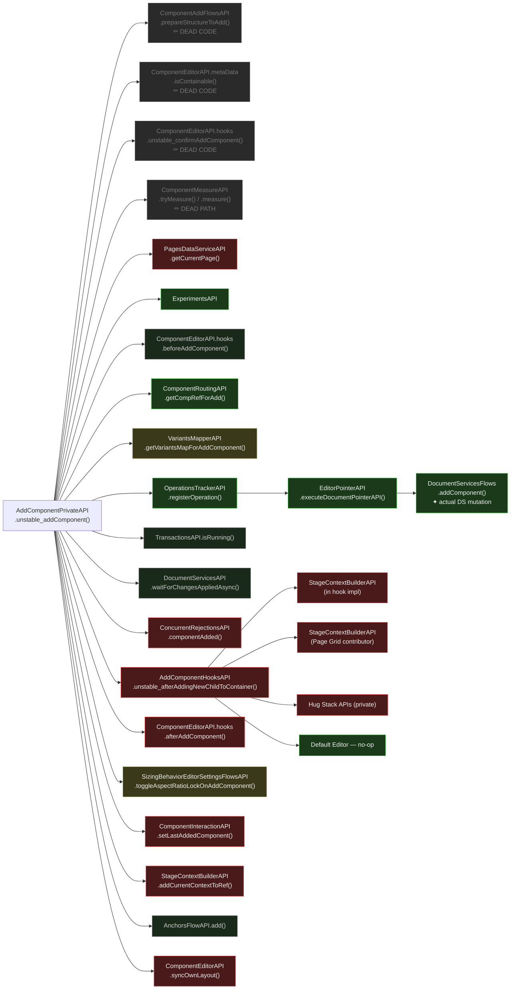

# unstable_addComponent — Isomorphic Breaking Point Analysis

Analysis of `AddComponentPrivateAPI.unstable_addComponent()` against the isomorphic requirement:
core must be runnable on the server — no DOM, no browser APIs, no UI.

---

## Verdict

`unstable_addComponent` is **client-only as-is**, but the document mutation core is clean and well-isolated.

The breaking deps form three groups:
1. **Post-mutation UI side effects** — stage context, interaction tracking, anchors (naturally client-only, easily excluded)
2. **Notification/hook infrastructure** — deeply contaminated by client-only contributors
3. **Layout sync** — measurement-dependent for Grid/AR components

**Key surprise:** `ConcurrentRejectionsAPI` — assumed safe — is **RED** (depends on `PreviewAPI` + `SnackbarFlowsAPI`).

---

## Reclassifications from Research

### From deep method tracing

| API | Was | Now | Reason |
|---|---|---|---|
| `ConcurrentRejectionsAPI.componentAdded()` | ✓ Probably OK | ✗ RED | deps include `PreviewAPI`, `SnackbarFlowsAPI`, `ComponentLayoutAPI_deprecated` |
| `AnchorsFlowAPI.add()` | ⚠️ Unknown | ✓ GREEN | `HistoryAPI` server-compatible + `InteractionContextAPI` confirmed generic scope wrapper (no DOM/UI) |
| `ComponentEditorAPI.syncOwnLayout()` | ⚠️ Unknown | ✗ RED (Grid/AR) | Grid + AR implementations call `ComponentMeasureAPI` + `StageContextBuilderAPI` |
| `PagesDataServiceAPI.getCurrentPage()` | ✓ Close to GREEN | ✗ RED | wraps `extendedDocumentServicesAPI.pages.getCurrentPage()` — which is a **forbidden DS operation** |
| `SizingBehaviorEditorSettingsFlowsAPI` | ⚠️ Unknown | ⚠️ ORANGE | method itself is data-only; entry point declares `StageContextBuilderAPI` + `ComponentInteractionAPI` |
| `VariantsMapperAPI` | ✓ Probably GREEN | ⚠️ ORANGE | 2 contributors found: Breakpoints (ORANGE — chains via `PreviewDisplayAPI`+`ClientDimensionsAPI`) + Repeater Patterns (GREEN — pure pointer comparison) |

### HistoryAPI correction (applies globally)

`HistoryAPI` has a **server-compatible implementation** — history recording is a no-op on the server but the
API is injectable. `batchHistory()` wrapping a data mutation does not block server execution.
This reclassifies `HistoryAPI` from RED → **ORANGE**.

Impact here: `AnchorsFlowAPI` was classified RED solely due to `HistoryAPI`. That dep is now safe.
`InteractionContextAPI` has also been confirmed as a **generic context scope wrapper** (DATA_SERVICE layer,
no DOM/browser event dependencies) — it tracks component state snapshots before/after operations, not
UI hover/click state. `AnchorsFlowAPI` is therefore reclassified to **GREEN**.

---

## Flow Diagram



**Legend:**
- 🔴 Red — client-only, breaking
- 🟡 Yellow — ambiguous, depends on contributors or further research
- ⬛ Grey — isomorphic (confirmed safe)
- 🟢 Green — isomorphic core (target)
- ⚫ Dark — dead code, eliminated by settled experiments

---

## Breaking Point Map

### Pre-mutation path — all safe

| API | Method | Verdict |
|---|---|---|
| `ExperimentsAPI` | *(gating)* | ✓ GREEN |
| `PagesDataServiceAPI` | `getCurrentPage()` | ✗ RED — wraps `ds.pages.getCurrentPage` (forbidden DS operation) |
| `ComponentEditorAPI.hooks` | `beforeAddComponent()` | ✓ GREEN — only vector image contributors (network fetch) |
| `ComponentRoutingAPI` | `getCompRefForAdd()`, `getCompRefForDataUpdate()` | ✓ GREEN — pointer resolution |
| `VariantsMapperAPI` | `getVariantsMapForAddComponent()` | ⚠️ ORANGE — 2 contributors: Breakpoints (ORANGE, chains via `PreviewDisplayAPI`) + Repeater Patterns (GREEN) |
| `OperationsTrackerAPI` | `registerOperation()` | ✓ GREEN — pure in-memory tracking |
| `EditorPointerAPI` | `executeDocumentPointerAPI()` | ✓ GREEN — pointer dispatch |
| `DocumentServicesFlows` | `addComponent()` | ✓ GREEN — single dep (`ExtendedDocumentServicesAPI`), structure normalization only |
| `TransactionsAPI` | `isRunning()` | ✓ GREEN — in-memory flag check |
| `DocumentServicesAPI` | `waitForChangesAppliedAsync()` | ✓ GREEN — async doc propagation |

### Post-mutation path — breaking

| API | Method | Verdict | Root cause |
|---|---|---|---|
| `ConcurrentRejectionsAPI` | `componentAdded()` | ✗ RED | `PreviewAPI` + `SnackbarFlowsAPI` in entry point; shows UI snackbar after 5s |
| `AddComponentHooksAPI` | `unstable_afterAddingNewChildToContainer()` | ✗ RED | entry point declares `StageContextBuilderAPI`; 3/4 contributors RED |
| `SizingBehaviorEditorSettingsFlowsAPI` | `toggleAspectRatioLockOnAddComponent()` | ⚠️ ORANGE | method is data-only; entry point has `StageContextBuilderAPI` + `ComponentInteractionAPI` |
| `ComponentInteractionAPI` | `setLastAddedComponent()` | ✗ RED | Editor UI — UI selection tracking |
| `StageContextBuilderAPI` | `addCurrentContextToRef()` | ✗ RED | Stage/Preview — adds variant context to ref |
| `AnchorsFlowAPI` | `add()` | ✓ GREEN | `HistoryAPI` server-compatible + `InteractionContextAPI` is generic scope wrapper (no DOM) |
| `ComponentEditorAPI.hooks` | `afterAddComponent()` | ✗ RED | 5+ RED contributors out of ~10 |
| `ComponentEditorAPI` | `syncOwnLayout()` | ✗ RED (Grid/AR) | Grid + AR call `ComponentMeasureAPI` + `StageContextBuilderAPI`; default is no-op |

---

## Hook Contamination Detail

### `unstable_afterAddingNewChildToContainer` contributors

| Contributor | RED APIs used | Verdict |
|---|---|---|
| **AddComponentHooksAPI default impl** | `StageContextBuilderAPI`, `VariantsIteratorAPI`, `ComponentLayoutDerivativeStateAPI` | ✗ RED |
| **Page Grid Editor** | `StageContextBuilderAPI`, `PageGridFlowsPrivateAPI` | ✗ RED |
| **Hug Stack Editor** | `HugStackDerivativeStatePrivateAPI`, `HugStackContributionsPrivateAPI` | ✗ RED |
| **Default Component Editor** | — | ✓ GREEN (no-op) |

Entry point itself also declares `StageContextBuilderAPI`.

### `afterAddComponent` contributors

| Contributor | RED APIs used | Verdict |
|---|---|---|
| **Hug Stack Editor** | `StageContextBuilderAPI` | ✗ RED |
| **Hug Stack Item Editor** | `HugStackActionFlowsPrivateAPI` (private stage API) | ✗ RED |
| **Section Grid** | `DOMOrderAPI.reorderPageSection()` | ✗ RED (DOM Order category) |
| **Hamburger Toggle** | `ComponentSelectFlowsAPI` | ✗ RED |
| **Responsive Menu** | `ComponentSelectFlowsAPI` | ✗ RED |
| **Image X** | `componentDataAPI`, `imageXFlowsAPI` | ✓ GREEN |
| **Section Behaviours** | `pagesDataServiceAPI` (ORANGE) | ⚠️ ORANGE |
| **TPA Widget / Glued / Section** | `tpaAPI.setCSSPerBreakpointEnabledForInstance()` | ⚠️ Unknown |
| **Multilingual** | `isInTranslationMode()`, notification | ✓ GREEN |
| **Mobile-Only Enhancer** *(Harmony)* | `StageContextBuilderAPI`, `OdeditorBreakpointsAPI` | ✗ RED |
| **Default Component Editor** | `hideComponentInBiggerBreakpointsAfterAdd()` | ✓ GREEN |

### `beforeAddComponent` contributors

| Contributor | APIs used | Verdict |
|---|---|---|
| **Vector Image** | `documentServicesAPI.media.vectorImage.fetchSvg()` | ✓ GREEN |
| **Vector Art** | `documentServicesAPI.media.vectorImage.fetchSvg()` | ✓ GREEN |

---

## Solutions

### 1. `StageContextBuilderAPI.addCurrentContextToRef()` — Server-safe stub

**Problem:** Adds the current breakpoint/variant context to a component ref so layout updates
target the right variant. On the server there is no "current context".

**Solution:** Provide a server-safe `StageContextBuilderAPI` implementation where
`addCurrentContextToRef(ref)` is an identity function — returns the ref unchanged.
The server operates on bare (contextless) refs, which is correct: on the server there
are no breakpoints being edited.

**Impact:** This single fix unblocks multiple RED deps in one shot:
- The direct call in the add flow
- `AddComponentHooksAPI` default impl
- Page Grid contributor in `unstable_afterAddingNewChildToContainer`
- Grid `syncOwnLayout` implementation
- Aspect Ratio `syncOwnLayout` implementation
- Same pattern in the `removeComponent` Default branch

**Effort:** Low — one stub entry point, no changes to callers.

---

### 2. `ComponentInteractionAPI.setLastAddedComponent()` — Omit on server

**Problem:** Tracks the last added component for visual selection feedback in the editor UI.

**Solution:** Don't call this in the server path. It has no meaning on the server —
there is no selection state to update.

**Effort:** Minimal — conditional call guard.

---

### 3. `ConcurrentRejectionsAPI.componentAdded()` — Move to client path

**Problem:** Schedules a 5-second timer, then checks if the component was concurrently
rejected and shows a snackbar notification. Deps include `PreviewAPI` + `SnackbarFlowsAPI`.

**Solution:** Exclude entirely from the server path. Concurrent rejection UX (snackbar after
5s timeout) is inherently a client-side concern. On the server, concurrent conflicts would
be surfaced as errors in the API response, not UI toasts.

**Effort:** Minimal — conditional call guard.

---

### 4. `AddComponentHooksAPI.unstable_afterAddingNewChildToContainer()` — Two options

**Problem:** The hook adjusts the new component's layout under its parent (margins,
cross-breakpoint layout update). Entry point declares `StageContextBuilderAPI`.
3 of 4 contributors are client-only.

**Option A — Server-safe stub (quick, follows solution 1):**
If `StageContextBuilderAPI` returns bare refs on the server (solution 1), the default
implementation's core logic becomes viable: it reads layout state, calculates new margins,
and updates layout — all data operations. `VariantsIteratorAPI` (cross-breakpoint update)
still needs a server-safe stub or skip.

**Option B — Contributor declaration:**
Add a `serverSafe: boolean` flag to hook contributions. The hook runner skips
non-safe contributors on the server. Only the Default no-op runs server-side,
which is correct — post-add layout adjustment is a client visual concern.

**Option B is recommended** — Option A brings more logic to the server than needed.
Post-add layout adjustment is about visual stage positioning and can safely be
deferred to client execution.

**Effort:** Medium — infrastructure change to hook runner + marking each contributor.

---

### 5. `afterAddComponent` RED contributors — Contributor declaration

**Problem:** 5 of ~10 contributors use client-only APIs:
- Hug Stack → `StageContextBuilderAPI`
- Section Grid → `DOMOrderAPI.reorderPageSection()`
- Hamburger / Responsive menu → `ComponentSelectFlowsAPI`

**Solution:** Same `serverSafe: boolean` declaration system as solution 4.
- Server path runs: Image X, Multilingual, Default (all data/flag operations)
- Server path skips: Hug Stack, Section Grid, Hamburger, Responsive Menu

The skipped contributors are all about visual post-placement behaviour (stack spacing,
DOM render order, menu selection) — none of these have server-side meaning.

**Effort:** Medium — same infrastructure as solution 4 amortizes this.

---

### 6. `ComponentEditorAPI.syncOwnLayout()` Grid/AR — Data-input pattern

**Problem:** Grid and Aspect Ratio implementations call `componentMeasureAPI.tryMeasure/measureOrThrow()`
to get current dimensions, then use `StageContextBuilderAPI` for variant-aware layout updates.

**Solution:** Since `compMeasure`/`containerMeasure` are always provided as parameters in
the add flow (settled experiment guarantee), pass them down into the enhancers instead of
re-measuring. The enhancers already receive enough information — they just don't use it.

With measurements provided as data input + `StageContextBuilderAPI` stub (solution 1),
`syncOwnLayout` becomes fully server-safe for Grid and AR components.

**Effort:** Medium — modify Grid + AR enhancers to accept optional pre-provided measurements.

---

### 7. `AnchorsFlowAPI.add()` — Resolved GREEN

**Status:** GREEN — fully resolved.

`HistoryAPI` was the initial concern (server-compatible no-op — see HistoryAPI correction section).
`InteractionContextAPI.runInContext()` was confirmed to be a **generic scope wrapper** — it tracks
component state snapshots before/after operations (DATA_SERVICE layer, no DOM/browser event dependencies).
Not to be confused with `ComponentInteractionAPI` which manages UI selection/hover state.

Both deps safe → `AnchorsFlowAPI` is **GREEN**, no further action needed.

---

### 8. `SizingBehaviorEditorSettingsFlowsAPI` — Entry point split

**Problem:** `toggleAspectRatioLockOnAddComponent()` is pure data (reads component
metadata, writes editor settings). The entry point also declares `StageContextBuilderAPI`
and `ComponentInteractionAPI` for other methods in the same entry point.

**Solution:** Extract `toggleAspectRatioLockOnAddComponent()` into a separate entry
point that only depends on `EditorSettingsAPI`, `ComponentEditorAPI.sizingBehaviour`,
and `SizingBehaviorEditorSettingsContributionPrivateAPI`.

**Effort:** Low-Medium — entry point refactor, no logic changes.

---

## Structural Diagnosis

```
unstable_addComponent()
├── [DEAD]  prepareStructureToAdd, isContainable, confirmAddComponent, measurement fallback
│
├── ✗ RED           PagesDataServiceAPI.getCurrentPage() — ds.pages.getCurrentPage is forbidden
├── ✓ GREEN         beforeAddComponent hooks (vector image — network, no DOM)
├── ✓ GREEN         ComponentRoutingAPI, OperationsTrackerAPI
├── ✓ GREEN         DocumentServicesFlows.addComponent()  ← THE MUTATION
├── ✓ GREEN         waitForChangesAppliedAsync()
│
├── ✗ RED     ConcurrentRejectionsAPI  ← omit on server (solution 3)
│
├── ✗ RED     AddComponentHooksAPI.unstable_afterAddingNewChildToContainer()
│   ├── ✗ RED     default impl, Page Grid, Hug Stack  ← skip on server (solution 4)
│   └── ✓ GREEN   Default Editor no-op
│
├── ⚠ ORANGE  SizingBehaviorEditorSettingsFlowsAPI  ← entry point split (solution 8)
├── ✗ RED     ComponentInteractionAPI  ← omit on server (solution 2)
├── ✗ RED     StageContextBuilderAPI  ← server-safe stub (solution 1)
├── ✓ GREEN   AnchorsFlowAPI
│
├── ✗ RED (5+) afterAddComponent hooks
│   ├── ✗ RED    Hug Stack, Section Grid, Hamburger, Menu  ← skip on server (solution 5)
│   └── ✓ GREEN  Image X, Multilingual, Default
│
└── ✗ RED  ComponentEditorAPI.syncOwnLayout()
    ├── ✗ RED (Grid/AR)  ← data-input pattern (solution 6)
    └── ✓ GREEN  Default (no-op)
```

---

## Proposed Client/Server Split

### Server path

```
addComponent_server(containerRef, compStructure, options)
  → [PagesDataServiceAPI.getCurrentPage() — SKIP: forbidden DS operation]
  → ComponentEditorAPI.hooks.structure.beforeAddComponent()  [all contributors safe]
  → ComponentRoutingAPI.getCompRefForAdd()
  → VariantsMapperAPI.getVariantsMapForAddComponent()        [serverSafe contributors only]
  → OperationsTrackerAPI.registerOperation()
      → EditorPointerAPI.executeDocumentPointerAPI()
          → DocumentServicesFlows.addComponent()             ← mutation
  → DocumentServicesAPI.waitForChangesAppliedAsync()
  → ComponentEditorAPI.hooks.structure.afterAddComponent()   [serverSafe contributors only]
  → ComponentEditorAPI.syncOwnLayout()                       [with pre-provided measurements]
```

### Client path

```
addComponent_client(containerRef, compStructure, options)
  → addComponent_server()
  → ConcurrentRejectionsAPI.componentAdded()
  → AddComponentHooksAPI.unstable_afterAddingNewChildToContainer()
  → SizingBehaviorEditorSettingsFlowsAPI.toggleAspectRatioLockOnAddComponent()
  → ComponentInteractionAPI.setLastAddedComponent()
  → StageContextBuilderAPI.addCurrentContextToRef()
  → AnchorsFlowAPI.add()
```

---

## Key Takeaways

**1. The mutation core is already clean.**
`DocumentServicesFlows.addComponent()` has a single dep, does structure normalization, and delegates.

**2. `StageContextBuilderAPI` stub is the highest-leverage fix.**
One server-safe identity implementation unblocks 5+ RED deps across the flow.

**3. `ConcurrentRejectionsAPI` is easy to move.**
Its entire purpose (snackbar after 5s) belongs on the client regardless. Remove from server path, done.

**4. The hook system needs a `serverSafe` declaration mechanism.**
`afterAddComponent` and `unstable_afterAddingNewChildToContainer` each have a mix of safe and
unsafe contributors. Without a declaration mechanism, the only option is to skip the entire hook
on the server — which loses valid server-side behaviour (Image X, Multilingual).

**5. `AnchorsFlowAPI` is GREEN — a useful pattern to replicate.**
Both its deps are server-safe: `HistoryAPI` (server-compatible no-op) and `InteractionContextAPI`
(generic context scope wrapper at DATA_SERVICE layer, no DOM/events). When evaluating other APIs,
look for the same pattern: infrastructure APIs at lower layers are often safe even when their names
sound UI-related.

**6. Post-mutation layout ops can wait for client.**
`syncOwnLayout`, `unstable_afterAddingNewChildToContainer`, and related layout hooks are all
about visual placement on the stage. This work doesn't need to happen on the server.

---

## Harmony-Specific Additions

Harmony (`/Users/ivant/projects/odeditor-packages-new`) adds further contributors and hooks
on top of the REP base layer.

### `afterAddComponent` — Harmony mobile-only enhancer

**File:** `odeditor-editor-package-breakpoints/src/createMobileOnlyComponentsEnhancer.tsx`

Called via `ComponentEditorAPI.hooks.structure.afterAddComponent` in Harmony.

| API used | Classification |
|---|---|
| `StageContextBuilderAPI` | ✗ RED |
| `OdeditorBreakpointsAPI` | ✗ RED (stage-aware breakpoint metadata) |

Verdict: **RED**. Hides the component in larger breakpoints after add — a purely visual
stage operation with no server-side meaning.

---

### `AfterAddComponentSlot` (Harmony private slot)

**SlotKey:** `AfterAddComponentSlot`, FLOWS layer.
**File:** `editor-package-component-editors/src/afterAddComponentSlot.ts`

Separate from the REP `afterAddComponent` hook. Harmony adds 3 contributors:

| Contributor | APIs used | Verdict |
|---|---|---|
| **Menu handler** | `ComponentSelectFlowsAPI` | ✗ RED |
| **Repeater + Collection handler** | `documentServicesAPI.platform.controllers.getStageData()` | ✗ RED (forbidden DS op) |
| **Grouped Elements handler** | `ComponentSelectFlowsAPI` | ✗ RED |

All 3 contributors are **RED**. `AfterAddComponentSlot` is client-only in Harmony.

---

### TPA Add Component Hook (Harmony)

**File:** `editor-package-tpa/src/hooks/tpaAddComponentHook.ts` *(Harmony variant)*

Executed as part of the add flow for TPA components.

| API used | Classification | Reason |
|---|---|---|
| `ComponentMeasureAPI` | ✗ RED | DOM measurement |
| `PreviewDisplayAPI` | ✗ RED | Stage/Preview |
| `StageContextBuilderAPI` | ✗ RED | Stage/Preview |
| `OdeditorLayoutBuilderAPI` | ✗ RED | See below |

Verdict: **RED**. All 4 deps are client-only. TPA add is inherently a runtime browser flow
(TPA SDK, iframe communication, stage positioning).

---

### `OdeditorLayoutBuilderAPI` in media adds

**File:** `editor-package-add-panel-logic/src/createAddPanelLogicAPI.ts`

Used for image, video, and SVG component additions to calculate initial layout sizing
from media metadata (aspect ratio, natural dimensions → CSS layout values).

`OdeditorLayoutBuilderAPI` is declared in the `editor-package-add-panel-logic` entry point
as a direct dependency for this sizing calculation.

Verdict: **RED** — `OdeditorLayoutBuilderAPI` depends on `StageContextBuilderAPI` and
`PreviewDisplayAPI`. Even though the actual sizing calculation is data-based, the API is
not injectable without its full stage-aware dependency chain.

**Potential fix:** Extract the pure layout-math portion (aspect ratio → CSS size) into
a standalone utility that doesn't require `OdeditorLayoutBuilderAPI`. The input data
(media natural dimensions) is always available at add time.
