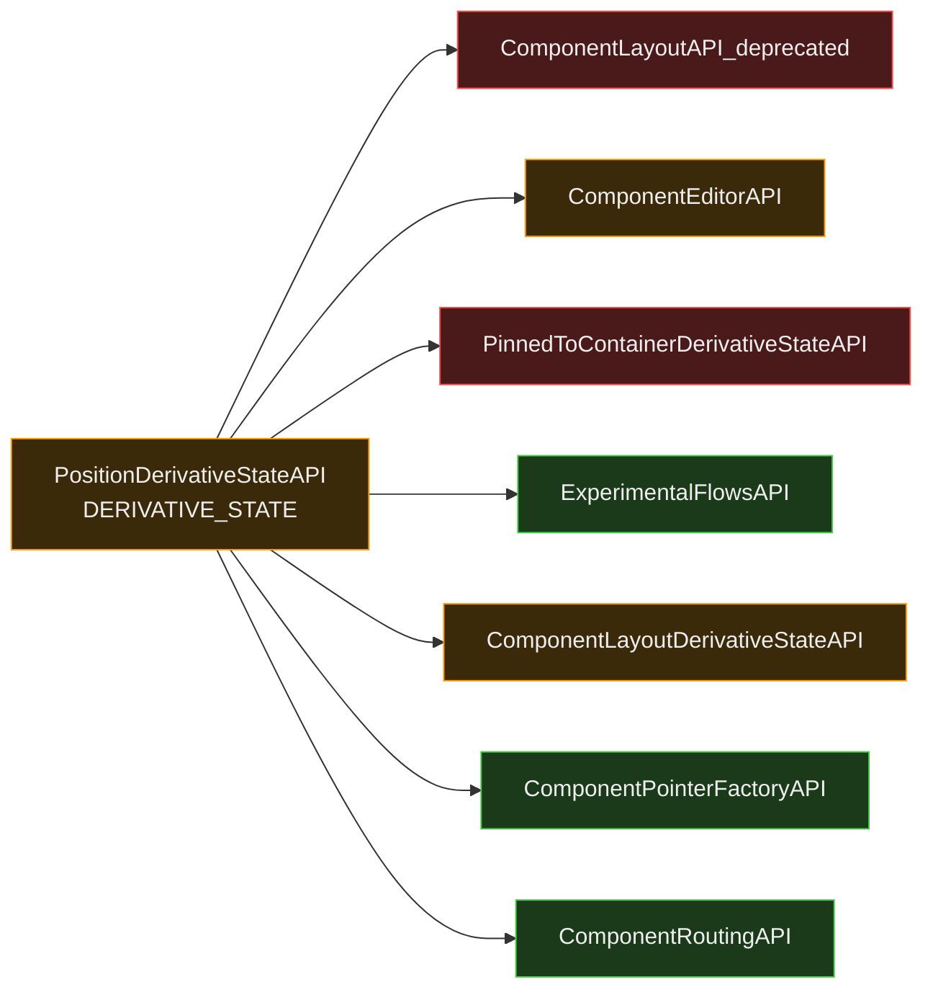
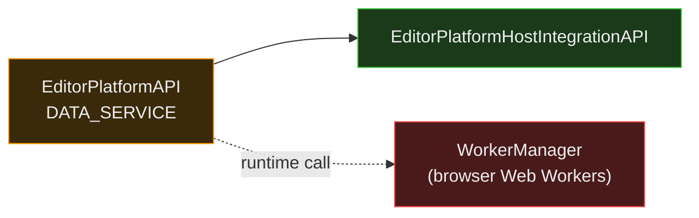
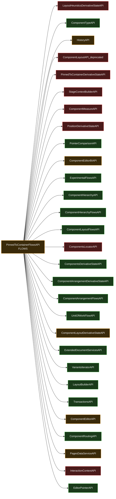
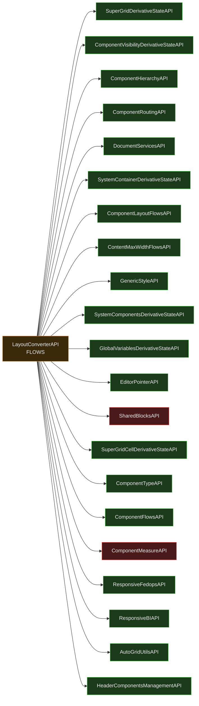
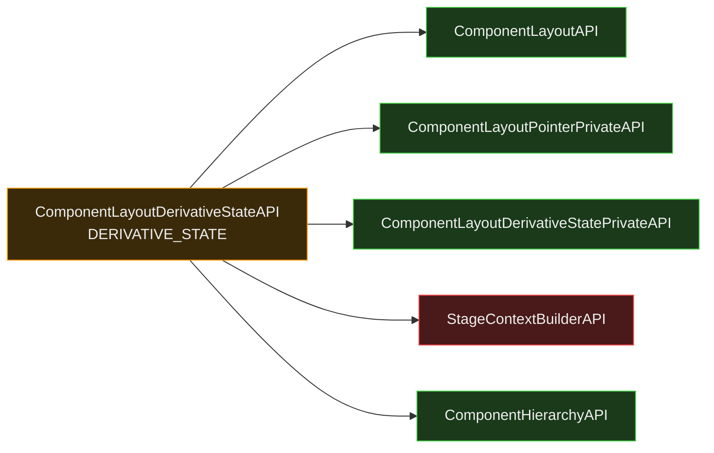
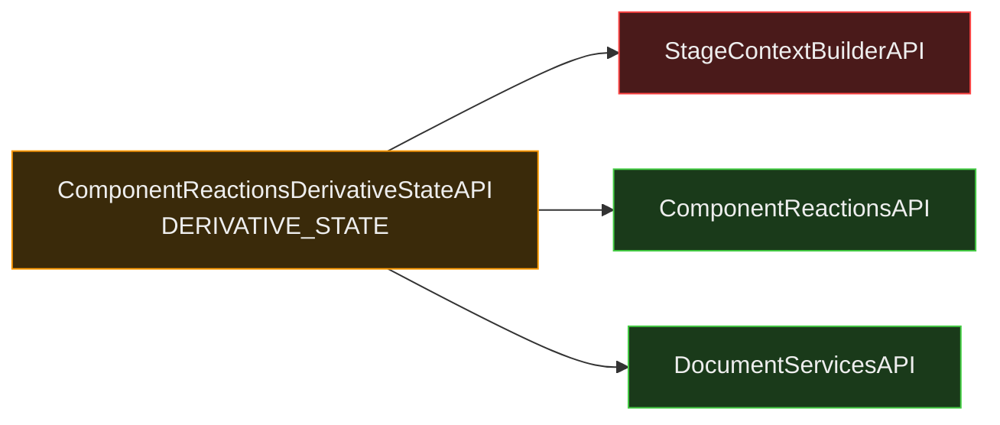

# Orange APIs — Dependency Graphs

Dependency graphs for all 9 ORANGE APIs from the site-optimizer actions analysis.
Each dep is classified using `ISOMORPHIC_CLASSIFICATION_RULES.md`.

**Legend:**
- 🔴 Red node — client-only (DOM, browser, Editor UI, Stage/Preview, HistoryAPI, etc.)
- 🟠 Orange node — ambiguous, needs case-by-case or per-method analysis
- 🟢 Green node — isomorphic, server-safe

---

## Verdict Summary

| API | Layer | RED deps | ORANGE deps | Verdict after analysis |
|---|---|---|---|---|
| PagesDataServiceAPI | DATA_SERVICE | PreviewAPI, EditorCacheAPI | PagesDataServicePrivateAPI | ORANGE — 2 RED deps, isomorphic methods exist |
| ComponentEditorAPI | EDITOR_INFRA | MouseAPI, PreviewAPI, EditorCacheAPI, ComponentEditorCachePrivateAPI + extends 4 Stage/UI interfaces | TraverseDataServiceAPI, SequenceLoaderAPI | ORANGE → heavily RED-leaning, large split needed |
| PositionDerivativeStateAPI | DERIVATIVE_STATE | ComponentLayoutAPI_deprecated, PinnedToContainerDerivativeStateAPI | ComponentEditorAPI | **Reclassify → RED** — 2 RED deps including reclassified PinnedToContainerDerivativeStateAPI |
| ComponentEditorBIAPI | EDITOR_INFRA | Same RED deps as ComponentEditorAPI (shared entry point) | TraverseDataServiceAPI, SequenceLoaderAPI | ORANGE — BI itself is server-OK, needs its own entry point to shed ComponentEditorAPI's dep chain |
| AddPanelDataAPI | DERIVATIVE_STATE | PanelsAPI, AddPanelStateAPI | EditorParamsAPI | ORANGE — data fetch is isomorphic, panel state is RED |
| OdeditorLayoutBuilderAPI | DERIVATIVE_STATE | ComponentMeasureAPI | LayoutGeneratorAPI | **Reclassify → RED** — direct ComponentMeasureAPI dep (root cause, 102 refs) |
| EditorPlatformAPI | DATA_SERVICE | WorkerManager (runtime call) | — | ORANGE → close to GREEN, only runtime WorkerManager is the blocker; `getStyle()`/`getData()` are fully GREEN (bypass WorkerManager) |
| PinnedToContainerFlowsAPI | FLOWS | 10+ RED deps | PositionDerivativeStateAPI, ComponentEditorBIAPI, ComponentEditorAPI, PagesDataServiceAPI | ORANGE — concept is isomorphic, impl is not |
| LayoutConverterAPI | FLOWS | ComponentMeasureAPI, SharedBlocksAPI | — | ORANGE — concept is isomorphic, 2 RED root causes |
| ComponentLayoutDerivativeStateAPI | DERIVATIVE_STATE (REP) | StageContextBuilderAPI (via `unstable_getCurrentEffectiveLayout`) | — | ORANGE — reclassified from GREEN; pointer-based methods likely server-safe; single stub fix → GREEN |
| ComponentReactionsDerivativeStateAPI | DERIVATIVE_STATE (REP) | StageContextBuilderAPI (via `getCurrentEffective`) | — | ORANGE — reclassified from GREEN; other reaction/effect methods are GREEN; same stub fix → GREEN |

---

## 1. PagesDataServiceAPI

**Layer:** DATA_SERVICE (REP)

**RED deps:**
- `PreviewAPI` — Stage/Preview (root cause, 161 refs)
- `EditorCacheAPI` — Editor State (client-side caching)

**Fix:** Remove `PreviewAPI` and `EditorCacheAPI` from the server path. Both are used by `getFocusedPageId()` / `getCurrentPageId()` style methods. The data-only methods (`isPage()`, `getPageData()`, etc.) don't need them.

---

## 2. ComponentEditorAPI

**Layer:** EDITOR_INFRA (REP)

**RED deps:**
- `MouseAPI` — User Input (browser events)
- `PreviewAPI` — Stage/Preview (root cause)
- `EditorCacheAPI` — Editor State
- `ComponentEditorCachePrivateAPI` — Editor State (also depends on PreviewAPI)
- `UiBehaviorsStageAPI` / `UiBehaviorsWorkspaceAPI` / `StageIndicatorsAPI` / `StageDataAPI` — interface extensions, all Stage/Editor UI

**Note:** This API is the single most coupled API in the graph. It is a large API covering many concerns — any server migration requires a significant split, extracting only the data/structure methods.

---

## 3. PositionDerivativeStateAPI

**Layer:** DERIVATIVE_STATE (REP)

**RED deps:**
- `ComponentLayoutAPI_deprecated` — deprecated, must not exist on server
- `PinnedToContainerDerivativeStateAPI` — recently reclassified to RED (PreviewAPI + LayoutHeuristicsAPI + EditorCacheAPI all RED)

**⚠️ Reclassify to RED.** Both RED deps are direct, not transitive. The only non-green non-red dep (`ComponentEditorAPI`) is itself heavily RED-leaning. The `getPosition()` method may be salvageable but requires reimplementation without these deps.

---

## 4. ComponentEditorBIAPI

**Layer:** EDITOR_INFRA (REP)

**Key note:** `ComponentEditorBIAPI` is declared in the same entry point as `ComponentEditorAPI` — it inherits the entire dep chain even though BI itself is server-OK. The RED deps here are not intrinsic to BI; they belong to other APIs in the same entry point.

**Fix:** Extract `ComponentEditorBIAPI` into its own entry point with only the deps it actually needs. BI sending is server-safe — the RED chain is inherited baggage, not inherent.

---

## 5. AddPanelDataAPI

**Layer:** DERIVATIVE_STATE (Harmony)

**RED deps:**
- `PanelsAPI` — Editor UI (panel = always client-only)
- `AddPanelStateAPI` — Editor State (tracks panel open/closed state, UI concern)

**Fix:** The data fetching methods (`getData()`, template resolution) are fully isomorphic. `PanelsAPI` and `AddPanelStateAPI` are only used for panel open/close state, not for the data itself. Split into data-only server interface.

---

## 6. OdeditorLayoutBuilderAPI

**Layer:** DERIVATIVE_STATE (Harmony)

**RED deps:**
- `ComponentMeasureAPI` — DOM Measurements (root cause, 102 refs)

**⚠️ Reclassify to RED.** `ComponentMeasureAPI` is a direct dependency and is a known root cause. This confirms the earlier suspicion ("may depend on measurement hints"). The API cannot be isomorphic in its current form.

**Fix:** Pass layout dimensions as data inputs instead of measuring via `ComponentMeasureAPI`. This is the same pattern proposed for the flex actions (`StageContextBuilderAPI` replacement).

---

## 7. EditorPlatformAPI

**Layer:** DATA_SERVICE (REP)

**RED deps:**
- `WorkerManager` — not a declared dep, accessed via `getWorkerManager()` at runtime. Browser Web Workers are client-only.

**Note:** This is the closest ORANGE API to GREEN. Its only declared dep is `EditorPlatformHostIntegrationAPI` (🟢). The blocker is a single runtime call to `getWorkerManager()`. A server-side SDK host that doesn't use a WorkerManager would make this fully isomorphic.

---

## 8. PinnedToContainerFlowsAPI

**Layer:** FLOWS (REP)

**RED deps (8):** `LayoutHeursticsDerivativeStateAPI`, `ComponentLayoutAPI_deprecated`, `PinnedToContainerDerivativeStateAPI`, `StageContextBuilderAPI`, `ComponentMeasureAPI`, `PositionDerivativeStateAPI` *(reclassified RED)*, `ComponentsLocatorAPI`, `InteractionContextAPI`

**ORANGE deps (updated):** `HistoryAPI` — has server-compatible implementation (no-op history recording)

---

## 9. LayoutConverterAPI

**Layer:** FLOWS (REP)

**RED deps (2):** `ComponentMeasureAPI` — measurement root cause; `SharedBlocksAPI` — *(reclassified)* uses `pagesDataServiceAPI.getFocusedPage/getCurrentPage()` (forbidden DS ops) + `previewAPI.memoizeForSiteUpdates()`.

**Fix:** Replace `ComponentMeasureAPI` usage with data-input parameters; replace `SharedBlocksAPI` with server-safe shared blocks data service.

---

---

## 10. ComponentLayoutDerivativeStateAPI

**Layer:** DERIVATIVE_STATE (REP)

**RED deps (1):** `StageContextBuilderAPI` — used by `unstable_getCurrentEffectiveLayout(comp)` to inject current variant/breakpoint context into a bare comp ref.

**Method split:**
- `getScopedLayout(pointer)`, `getEffectiveLayout(pointer)` — take context-qualified pointers; server-safe if caller provides the right pointer
- `unstable_getCurrentEffectiveLayout(comp)` — reads current stage context (RED); not used by site-optimizer actions

**Fix:** Implement `StageContextBuilderAPI.addCurrentContextToRef()` as identity on server (returns the ref unchanged). This unblocks all three methods and makes the API fully GREEN. Same stub unblocks all flex actions.

---

## 11. ComponentReactionsDerivativeStateAPI

**Layer:** DERIVATIVE_STATE (REP)

**RED deps (1):** `StageContextBuilderAPI` — used by `getCurrentEffective()` to inject current variant/breakpoint context.

**Method split:**
- `getCurrentEffective(pointer)` — calls `stageContextBuilderAPI.addCurrentContextToRef()` → ORANGE
- All other methods (reaction/effect queries) — do not use StageContextBuilderAPI → GREEN

**Used by:** `AnimationFlowsPrivateAPI` — only GREEN methods called in the animation path, so `AnimationFlowsPrivateAPI` remains effectively GREEN for site-optimizer animation actions.

**Fix:** Same `StageContextBuilderAPI` identity stub as above → fully GREEN.

---

## Reclassifications from This Analysis

| API | Was | Now | Reason |
|---|---|---|---|
| `PositionDerivativeStateAPI` | 🟠 | 🔴 | `PinnedToContainerDerivativeStateAPI` (RED) + `ComponentLayoutAPI_deprecated` (RED) are direct deps |
| `OdeditorLayoutBuilderAPI` | 🟠 | 🔴 | Direct `ComponentMeasureAPI` dep confirmed — measurement root cause |
| `ComponentLayoutDerivativeStateAPI` | 🟢 | 🟠 | Entry point declares `StageContextBuilderAPI`; `unstable_getCurrentEffectiveLayout` uses current stage context |
| `ComponentReactionsDerivativeStateAPI` | 🟢 | 🟠 | Entry point declares `StageContextBuilderAPI`; `getCurrentEffective()` uses current stage context |
