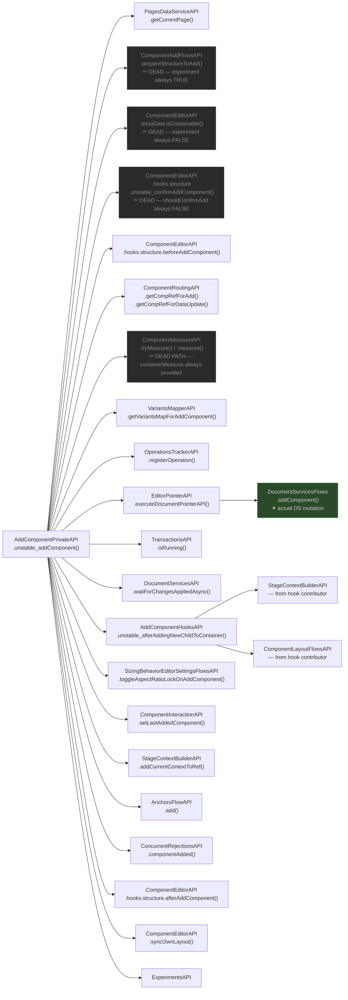

# unstable_addComponent — Dependency Research

Entry point: `AddComponentPrivateAPI.unstable_addComponent()` in `editor-package-component-editors`.

**SlotKey**: `AddComponentPrivateAPI`, FLOWS layer
**File**: `editor-package-component-editors/src/createAddComponentPrivateAPI.ts`

---

## Mermaid Diagram

---

## API Dependencies

**File**: `editor-package-component-editors/src/createAddComponentPrivateAPI.ts`

### Live Path (after settled experiments applied)

| API | Methods | Purpose |
|---|---|---|
| `ExperimentsAPI` | *(experiment branches)* | Branch gating — settled experiments eliminate dead paths |
| `PagesDataServiceAPI` | `getCurrentPage()` | Get current page context for add |
| `ComponentEditorAPI` | `hooks.structure.beforeAddComponent()` | Lifecycle hook before component added |
| `ComponentRoutingAPI` | `getCompRefForAdd()`, `getCompRefForDataUpdate()` | Resolve canonical comp refs for add operation |
| `VariantsMapperAPI` | `getVariantsMapForAddComponent()` | Get variants mapping for the new component |
| `OperationsTrackerAPI` | `registerOperation()` | Register as hierarchy operation |
| `EditorPointerAPI` | `executeDocumentPointerAPI()` | Execute document pointer for actual add |
| `DocumentServicesFlows` | `addComponent()` | **Actual document model mutation** |
| `TransactionsAPI` | `isRunning()` | Check if transaction already running |
| `DocumentServicesAPI` | `waitForChangesAppliedAsync()` | Wait for document changes to propagate |
| `AddComponentHooksAPI` | `unstable_afterAddingNewChildToContainer()` | Post-add hook — uses `StageContextBuilderAPI` + `ComponentLayoutFlowsAPI` |
| `SizingBehaviorEditorSettingsFlowsAPI` | `toggleAspectRatioLockOnAddComponent()` | Adjust aspect ratio lock after add |
| `ComponentInteractionAPI` | `setLastAddedComponent()` | Track the last added component for selection |
| `StageContextBuilderAPI` | `addCurrentContextToRef()` | Add stage context to the new component ref |
| `AnchorsFlowAPI` | `add()` | Register anchors for new component |
| `ConcurrentRejectionsAPI` | `componentAdded()` | Notify concurrent ops system |
| `ComponentEditorAPI` | `hooks.structure.afterAddComponent()` | Lifecycle hook after component added |
| `ComponentEditorAPI` | `syncOwnLayout()` | Sync component's own layout post-add |

### Dead Paths (eliminated by settled experiments)

| API | Method | Reason eliminated |
|---|---|---|
| `ComponentAddFlowsAPI` | `prepareStructureToAdd()` | `specs.responsive-editor.addFlowNoStructureManipulation` is always TRUE |
| `ComponentEditorAPI` | `metaData.isContainable()` | `specs.responsive-editor.validateIsContainableBeforeAdd` is always FALSE |
| `ComponentEditorAPI` | `hooks.structure.unstable_confirmAddComponent()` | `shouldConfirmAdd` is always FALSE (except site creation) |
| `ComponentMeasureAPI` | `tryMeasure()`, `measure()` | `compMeasure`, `containerRef`, `containerMeasure` are always provided — fallback measurement paths are dead |

---

## Key Design Observations

1. **Settled experiments eliminate ~4 entire code paths.** After applying the classification rules, the live path is significantly shorter than the raw dependency list suggests.

2. **Measurement is a dead path — for the known callers.** `ComponentMeasureAPI` appears in the fallback branch for when `containerMeasure` is `undefined`. Per settled experiments this parameter is always defined in practice. However, `ComponentMeasureAPI` is still a declared dependency of the entry point — it would fail at injection if removed without refactoring.

3. **`DocumentServicesFlows.addComponent()` is the only true document mutation** — everything else is orchestration, hooks, BI, and UI.

4. **`AddComponentHooksAPI.unstable_afterAddingNewChildToContainer()`** is itself a hook slot — its RED contamination comes from a contributor that uses `StageContextBuilderAPI`, not from the hook definition itself.

5. **Two separate `StageContextBuilderAPI` calls:** One inside `AddComponentHooksAPI` (from a contributor), one directly as `StageContextBuilderAPI.addCurrentContextToRef()`. Both are RED (Stage/Preview logic).
