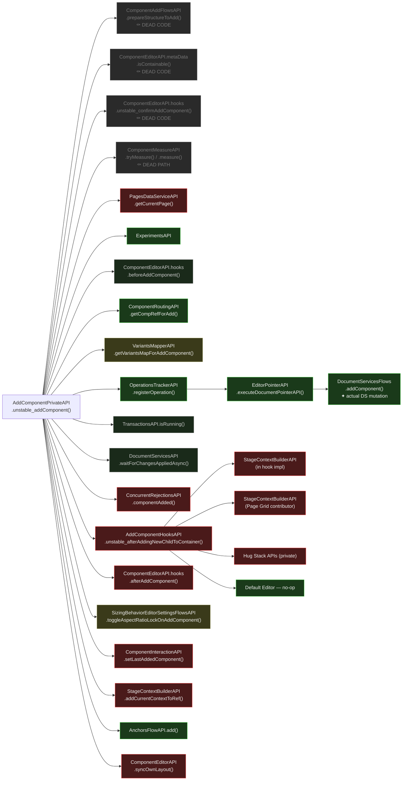

# unstable_addComponent — Isomorphic Analysis

Entry point: `AddComponentPrivateAPI.unstable_addComponent()` in `editor-package-component-editors` (REP).

**SlotKey:** `AddComponentPrivateAPI`, FLOWS layer
**File:** `editor-package-component-editors/src/createAddComponentPrivateAPI.ts`

---

## Verdict

**RED as-is**, but the document mutation core is clean and well-isolated.

The breaking deps form three groups:
1. **Post-mutation UI side effects** — stage context, interaction tracking, anchors (easily excluded)
2. **Notification/hook infrastructure** — contaminated by client-only contributors
3. **Layout sync** — measurement-dependent for Grid/AR components

**Key surprise:** `ConcurrentRejectionsAPI` — assumed safe — is RED (depends on `PreviewAPI` + `SnackbarFlowsAPI`).

---

## Reclassifications from Research

| API | Was | Now | Reason |
|---|---|---|---|
| `ConcurrentRejectionsAPI.componentAdded()` | ✓ Probably OK | ✗ RED | deps include `PreviewAPI`, `SnackbarFlowsAPI`, `ComponentLayoutAPI_deprecated` |
| `AnchorsFlowAPI.add()` | ⚠️ Unknown | ✓ GREEN | `HistoryAPI` server-compatible + `InteractionContextAPI` confirmed generic scope wrapper (no DOM/UI) |
| `ComponentEditorAPI.syncOwnLayout()` | ⚠️ Unknown | ✗ RED (Grid/AR) | Grid + AR call `ComponentMeasureAPI` + `StageContextBuilderAPI`; default is no-op |
| `PagesDataServiceAPI.getCurrentPage()` | ✓ Close to GREEN | ✗ RED | wraps `extendedDocumentServicesAPI.pages.getCurrentPage()` — forbidden DS operation |
| `SizingBehaviorEditorSettingsFlowsAPI` | ⚠️ Unknown | ⚠️ ORANGE | method itself is data-only; entry point declares `StageContextBuilderAPI` + `ComponentInteractionAPI` |
| `VariantsMapperAPI` | ✓ Probably GREEN | ⚠️ ORANGE | 2 contributors: Breakpoints (ORANGE — chains via `PreviewDisplayAPI`+`ClientDimensionsAPI`) + Repeater Patterns (GREEN) |

**HistoryAPI correction (global):** Has a server-compatible no-op implementation — `batchHistory()` wrapping is safe on server.
`HistoryAPI` is ORANGE (not RED). This reclassifies `AnchorsFlowAPI` to GREEN.

---

## Flow Diagram



**Legend:**
- 🔴 Red — client-only, breaking
- 🟡 Yellow — ambiguous, depends on contributors or further research
- ⬛ Grey — isomorphic (confirmed safe)
- 🟢 Green — isomorphic core (target)
- ⚫ Dark — dead code, eliminated by settled experiments

---

## Dead Paths (eliminated by settled experiments)

| API | Method | Reason eliminated |
|---|---|---|
| `ComponentAddFlowsAPI` | `prepareStructureToAdd()` | `specs.responsive-editor.addFlowNoStructureManipulation` always TRUE |
| `ComponentEditorAPI` | `metaData.isContainable()` | `specs.responsive-editor.validateIsContainableBeforeAdd` always FALSE |
| `ComponentEditorAPI` | `hooks.structure.unstable_confirmAddComponent()` | `shouldConfirmAdd` always FALSE (except site creation) |
| `ComponentMeasureAPI` | `tryMeasure()`, `measure()` | `compMeasure`/`containerMeasure` always provided — fallback paths dead |

---

## Breaking Point Map

### Pre-mutation — all safe

| API | Method | Verdict |
|---|---|---|
| `ExperimentsAPI` | *(gating)* | ✓ GREEN |
| `PagesDataServiceAPI` | `getCurrentPage()` | ✗ RED — wraps `ds.pages.getCurrentPage` (forbidden DS operation) |
| `ComponentEditorAPI.hooks` | `beforeAddComponent()` | ✓ GREEN — only vector image contributors (network fetch) |
| `ComponentRoutingAPI` | `getCompRefForAdd()`, `getCompRefForDataUpdate()` | ✓ GREEN — pointer resolution |
| `VariantsMapperAPI` | `getVariantsMapForAddComponent()` | ⚠️ ORANGE — 2 contributors: Breakpoints (ORANGE, chains via `PreviewDisplayAPI`) + Repeater Patterns (GREEN) |
| `OperationsTrackerAPI` | `registerOperation()` | ✓ GREEN — pure in-memory tracking |
| `EditorPointerAPI` | `executeDocumentPointerAPI()` | ✓ GREEN — pointer dispatch |
| `DocumentServicesFlows` | `addComponent()` | ✓ GREEN — single dep (`ExtendedDocumentServicesAPI`), structure normalization only |
| `TransactionsAPI` | `isRunning()` | ✓ GREEN — in-memory flag check |
| `DocumentServicesAPI` | `waitForChangesAppliedAsync()` | ✓ GREEN — async doc propagation |

### Post-mutation — breaking

| API | Method | Verdict | Root cause |
|---|---|---|---|
| `ConcurrentRejectionsAPI` | `componentAdded()` | ✗ RED | `PreviewAPI` + `SnackbarFlowsAPI`; shows UI snackbar after 5s |
| `AddComponentHooksAPI` | `unstable_afterAddingNewChildToContainer()` | ✗ RED | declares `StageContextBuilderAPI`; 3/4 contributors RED |
| `SizingBehaviorEditorSettingsFlowsAPI` | `toggleAspectRatioLockOnAddComponent()` | ⚠️ ORANGE | method is data-only; entry point has `StageContextBuilderAPI` + `ComponentInteractionAPI` |
| `ComponentInteractionAPI` | `setLastAddedComponent()` | ✗ RED | Editor UI — visual selection tracking |
| `StageContextBuilderAPI` | `addCurrentContextToRef()` | ✗ RED | Stage/Preview — adds variant context to ref |
| `AnchorsFlowAPI` | `add()` | ✓ GREEN | `HistoryAPI` server-compatible + `InteractionContextAPI` is generic scope wrapper |
| `ComponentEditorAPI.hooks` | `afterAddComponent()` | ✗ RED | 5+ RED contributors out of ~10 |
| `ComponentEditorAPI` | `syncOwnLayout()` | ✗ RED (Grid/AR) | Grid + AR call `ComponentMeasureAPI` + `StageContextBuilderAPI`; default is no-op |

---

## Hook Contamination Detail

### `unstable_afterAddingNewChildToContainer` contributors

| Contributor | RED APIs used | Verdict |
|---|---|---|
| **AddComponentHooksAPI default impl** | `StageContextBuilderAPI`, `VariantsIteratorAPI`, `ComponentLayoutDerivativeStateAPI` | ✗ RED |
| **Page Grid Editor** | `StageContextBuilderAPI`, `PageGridFlowsPrivateAPI` | ✗ RED |
| **Hug Stack Editor** | `HugStackDerivativeStatePrivateAPI`, `HugStackContributionsPrivateAPI` | ✗ RED |
| **Default Component Editor** | — | ✓ GREEN (no-op) |

Entry point itself also declares `StageContextBuilderAPI`.

### `afterAddComponent` contributors

| Contributor | RED APIs used | Verdict |
|---|---|---|
| **Hug Stack Editor** | `StageContextBuilderAPI` | ✗ RED |
| **Hug Stack Item Editor** | `HugStackActionFlowsPrivateAPI` | ✗ RED |
| **Section Grid** | `DOMOrderAPI.reorderPageSection()` | ✗ RED |
| **Hamburger Toggle** | `ComponentSelectFlowsAPI` | ✗ RED |
| **Responsive Menu** | `ComponentSelectFlowsAPI` | ✗ RED |
| **Image X** | `componentDataAPI`, `imageXFlowsAPI` | ✓ GREEN |
| **Section Behaviours** | `pagesDataServiceAPI` | ⚠️ ORANGE |
| **TPA Widget / Glued / Section** | `tpaAPI.setCSSPerBreakpointEnabledForInstance()` | ✗ RED — `TpaDataServiceAPI` on forbidden list |
| **Multilingual** | `isInTranslationMode()`, notification | ✓ GREEN |
| **Mobile-Only Enhancer** *(Harmony)* | `StageContextBuilderAPI`, `OdeditorBreakpointsAPI` | ✗ RED |
| **Default Component Editor** | `hideComponentInBiggerBreakpointsAfterAdd()` | ✓ GREEN |

### `beforeAddComponent` contributors

| Contributor | APIs used | Verdict |
|---|---|---|
| **Vector Image** | `documentServicesAPI.media.vectorImage.fetchSvg()` | ✓ GREEN |
| **Vector Art** | `documentServicesAPI.media.vectorImage.fetchSvg()` | ✓ GREEN |

---

## Solutions

### Solution 1 — `StageContextBuilderAPI` server-safe stub *(highest leverage)*

**Problem:** `addCurrentContextToRef(ref)` adds the current breakpoint/variant context to a
component ref. On the server there is no "current context".

**Solution:** Implement `addCurrentContextToRef(ref)` as identity — returns `ref` unchanged.
On the server, layout mutations apply to the base variant, which is correct.

**Unblocks (in this flow alone):** direct call, `AddComponentHooksAPI` default impl,
Page Grid contributor, Grid `syncOwnLayout`, AR `syncOwnLayout`. Same fix also
unblocks all flex layout actions and add component Harmony action.

**Effort:** Minimal.

---

### Solution 2 — `ComponentInteractionAPI.setLastAddedComponent()` — omit on server

**Problem:** Tracks the last added component for visual selection feedback.

**Solution:** Conditional call guard — don't call in server path.

**Effort:** Minimal.

---

### Solution 3 — `ConcurrentRejectionsAPI.componentAdded()` — move to client path

**Problem:** Schedules a 5-second timer, checks for concurrent rejection, shows snackbar.
Deps: `PreviewAPI` + `SnackbarFlowsAPI`.

**Solution:** Exclude entirely from server path. Concurrent rejection UX is inherently
client-side. Server conflicts surface as API errors, not UI toasts.

**Effort:** Minimal.

---

### Solution 4 — Hook `serverSafe` declaration mechanism

**Problem:** Both `afterAddComponent` and `unstable_afterAddingNewChildToContainer` have a
mix of server-safe and client-only contributors. Without a declaration mechanism, the entire
hook must be skipped on server — losing valid server-side behaviour (Image X, Multilingual).

**Solution:** Add `serverSafe: boolean` flag to hook contributions. The hook runner skips
non-safe contributors on the server.

- Server runs: Image X, Multilingual, Default (data/flag operations)
- Server skips: Hug Stack, Section Grid, Hamburger, Responsive Menu

**Effort:** Medium — infrastructure change to hook runner, then mark each contributor.

---

### Solution 5 — `ComponentEditorAPI.syncOwnLayout()` Grid/AR — data-input pattern

**Problem:** Grid and AR implementations re-measure the component to get dimensions, then
call `StageContextBuilderAPI` for variant-aware layout updates.

**Solution:** Since `compMeasure`/`containerMeasure` are always provided in the add flow,
pass them down into the enhancers instead of re-measuring. With measurements as input +
`StageContextBuilderAPI` stub (Solution 1), `syncOwnLayout` becomes fully server-safe.

**Effort:** Medium — modify Grid + AR enhancers to accept pre-provided measurements.

---

### Solution 6 — `SizingBehaviorEditorSettingsFlowsAPI` — entry point split

**Problem:** `toggleAspectRatioLockOnAddComponent()` is pure data. Entry point also declares
`StageContextBuilderAPI` and `ComponentInteractionAPI` for other methods.

**Solution:** Extract `toggleAspectRatioLockOnAddComponent()` into a separate entry point
that only depends on `EditorSettingsAPI`, `ComponentEditorAPI.sizingBehaviour`, and
`SizingBehaviorEditorSettingsContributionPrivateAPI`.

**Effort:** Low-Medium — entry point refactor, no logic changes.

---

## Structural Diagnosis

```
unstable_addComponent()
├── [DEAD]  prepareStructureToAdd, isContainable, confirmAddComponent, measurement fallback
│
├── ✗ RED           PagesDataServiceAPI.getCurrentPage()   ← forbidden DS op; skip on server
├── ✓ GREEN         beforeAddComponent hooks (vector image — network, no DOM)
├── ✓ GREEN         ComponentRoutingAPI, OperationsTrackerAPI
├── ✓ GREEN         DocumentServicesFlows.addComponent()   ← THE MUTATION
├── ✓ GREEN         waitForChangesAppliedAsync()
│
├── ✗ RED     ConcurrentRejectionsAPI                      ← omit on server (Solution 3)
│
├── ✗ RED     AddComponentHooksAPI
│   ├── ✗ RED   default impl, Page Grid, Hug Stack         ← skip on server (Solution 4)
│   └── ✓ GREEN Default Editor no-op
│
├── ⚠ ORANGE  SizingBehaviorEditorSettingsFlowsAPI         ← entry point split (Solution 6)
├── ✗ RED     ComponentInteractionAPI                      ← omit on server (Solution 2)
├── ✗ RED     StageContextBuilderAPI                       ← server-safe stub (Solution 1)
├── ✓ GREEN   AnchorsFlowAPI
│
├── ✗ RED (5+) afterAddComponent hooks
│   ├── ✗ RED    Hug Stack, Section Grid, Hamburger, Menu  ← skip on server (Solution 4)
│   └── ✓ GREEN  Image X, Multilingual, Default
│
└── ✗ RED   ComponentEditorAPI.syncOwnLayout()
    ├── ✗ RED (Grid/AR)                                    ← data-input pattern (Solution 5)
    └── ✓ GREEN  Default (no-op)
```

---

## Proposed Client/Server Split

### Server path

```
addComponent_server(containerRef, compStructure, options)
  → [PagesDataServiceAPI.getCurrentPage() — SKIP: forbidden DS op]
  → ComponentEditorAPI.hooks.structure.beforeAddComponent()   [all contributors safe]
  → ComponentRoutingAPI.getCompRefForAdd()
  → VariantsMapperAPI.getVariantsMapForAddComponent()         [serverSafe contributors only]
  → OperationsTrackerAPI.registerOperation()
      → EditorPointerAPI.executeDocumentPointerAPI()
          → DocumentServicesFlows.addComponent()              ← mutation
  → DocumentServicesAPI.waitForChangesAppliedAsync()
  → ComponentEditorAPI.hooks.structure.afterAddComponent()    [serverSafe contributors only]
  → ComponentEditorAPI.syncOwnLayout()                        [with pre-provided measurements]
```

### Client path

```
addComponent_client(containerRef, compStructure, options)
  → addComponent_server()
  → ConcurrentRejectionsAPI.componentAdded()
  → AddComponentHooksAPI.unstable_afterAddingNewChildToContainer()
  → SizingBehaviorEditorSettingsFlowsAPI.toggleAspectRatioLockOnAddComponent()
  → ComponentInteractionAPI.setLastAddedComponent()
  → StageContextBuilderAPI.addCurrentContextToRef()
  → AnchorsFlowAPI.add()
```

---

## Key Takeaways

1. **The mutation core is already clean.** `DocumentServicesFlows.addComponent()` has a single dep, does structure normalization, and delegates.

2. **`StageContextBuilderAPI` stub is the highest-leverage fix.** One identity-function implementation unblocks 5+ RED deps across the flow.

3. **`ConcurrentRejectionsAPI` is easy to move.** Its entire purpose (snackbar after 5s) belongs on the client. Remove from server path.

4. **The hook system needs a `serverSafe` declaration mechanism.** Both major hooks have a mix of safe and unsafe contributors. Without it, the only option is to skip the entire hook — losing valid server-side behaviour.

5. **`AnchorsFlowAPI` is GREEN — a useful pattern to replicate.** Both deps are server-safe: `HistoryAPI` (no-op impl) and `InteractionContextAPI` (generic scope wrapper, DATA_SERVICE layer, no DOM). Names can be misleading; trace to the implementation.

6. **Post-mutation layout ops can wait for client.** `syncOwnLayout`, `unstable_afterAddingNewChildToContainer`, and related hooks are about visual stage placement. None need to happen on the server.

---

## Harmony-Specific Additions

Harmony adds further contributors and hooks on top of the REP base layer.

### `afterAddComponent` — mobile-only enhancer

**File:** `odeditor-editor-package-breakpoints/src/createMobileOnlyComponentsEnhancer.tsx`

| API | Verdict |
|---|---|
| `StageContextBuilderAPI` | ✗ RED |
| `OdeditorBreakpointsAPI` | ✗ RED (stage-aware breakpoint metadata) |

Verdict: **RED**. Hides component in larger breakpoints after add — purely visual stage op.

---

### `AfterAddComponentSlot` (Harmony private slot)

**SlotKey:** `AfterAddComponentSlot`, FLOWS layer

3 contributors, all RED:

| Contributor | Verdict |
|---|---|
| Menu handler — `ComponentSelectFlowsAPI` | ✗ RED |
| Repeater + Collection — `ds.platform.controllers.getStageData()` (forbidden DS op) | ✗ RED |
| Grouped Elements — `ComponentSelectFlowsAPI` | ✗ RED |

---

### TPA Add Component Hook (Harmony)

**File:** `editor-package-tpa/src/hooks/tpaAddComponentHook.ts`

| API | Verdict |
|---|---|
| `ComponentMeasureAPI` | ✗ RED |
| `PreviewDisplayAPI` | ✗ RED |
| `StageContextBuilderAPI` | ✗ RED |
| `OdeditorLayoutBuilderAPI` | ✗ RED |

Verdict: **RED**. TPA add is inherently a browser flow (TPA SDK, iframe, stage positioning).

---

### `OdeditorLayoutBuilderAPI` in media adds

**File:** `editor-package-add-panel-logic/src/createAddPanelLogicAPI.ts`

Used for image/video/SVG adds to calculate initial layout from media metadata. Depends on `StageContextBuilderAPI` + `PreviewDisplayAPI` — **RED**. Potential fix: extract the pure aspect-ratio math into a standalone utility.

---

## `editorFlowAPI.contributePlugin` — Add-Topic Plugins

`EditorFlowAPI.run()` fires plugins contributed via `editorFlowAPI.contributePlugin` (with `topics: ['add']`) **around** the add-component transaction. These run at the outer `EditorFlowAPI` wrapper level — distinct from the hook system (`beforeAddComponent` / `afterAddComponent` / `AfterAddComponentSlot`) which runs inside `unstable_addComponent`.

**Consequence for server migration:** Replacing `EditorFlowAPI.run()` with `TransactionsAPI.run()` (Fix 2 in TLDR) skips all these plugins on the server. This is correct for the RED ones, but the AutoDOM reordering needs explicit consideration.

### Harmony — add-topic plugins (2)

| Package | Plugin | What It Does | Classification |
|---------|--------|-------------|---------------|
| `odeditor-package-auto-grid` | AutoGrid add | Triggers grid layout recalculation on parent containers; uses `ComponentMeasureAPI` (DOM measurement) + `StageContextBuilderAPI` | ✗ RED |
| `odeditor-package-auto-dom` | AutoDOM add | Calls `AutoDOMOrderFlowsAPI.runAutoReorderInParent()` to auto-reorder DOM elements after section add | ✗ RED — `AutoDOMOrderFlowsAPI` → `DOMSortingAPI` → `ComponentMeasureAPI` → `PreviewDisplayAPI` (iframe DOM) |

### REP — add-topic plugins (3)

| Package | Plugin | What It Does | Classification |
|---------|--------|-------------|---------------|
| `editor-package-components` | Component selection | Selects newly added component if `selectOnStage` set; uses `ComponentSelectFlowsAPI` + `StageContextBuilderAPI` | ✗ RED |
| `editor-package-component-editors` | Set last added | Tracks last added component for UI focus; uses `ComponentInteractionAPI` + `StageContextBuilderAPI` | ✗ RED |
| `editor-package-dom-order` | AutoDOM order | Calls `AutoDOMOrderFlowsAPI.runAutoReorderInParent()`; same as Harmony version | ✗ RED — same chain: `ComponentMeasureAPI` → `PreviewDisplayAPI` |

### Plugin execution order (within `EditorFlowAPI.run()`)

```
1. Before-render plugins  (shouldRollbackOnFailure=true, requiresPostActionMeasurements=false)
2. Critical plugins       (shouldRollbackOnFailure=true)
3. Transaction runs       ← unstable_addComponent lives here
4. Allowed-failure plugins (default)
```

AutoGrid and AutoDOM run as allowed-failure plugins (post-transaction).

### Server path implication

- **AutoGrid (RED)**: Layout recalculation after add is a stage/render concern. On server, caller provides layout directly — already captured in SITE_OPT_HARMONY_ADD_COMPONENT.md Solution 2.
- **Component selection + Set last added (RED)**: Pure UI state — correctly skipped on server.
- **AutoDOMOrderFlowsAPI (RED)**: `DOMSortingAPI` → `ComponentMeasureAPI` → `PreviewDisplayAPI` (iframe bounding box measurements). DOM reordering is a visual render-order concern — correctly skipped on server. The document model itself isn't affected by render order.
