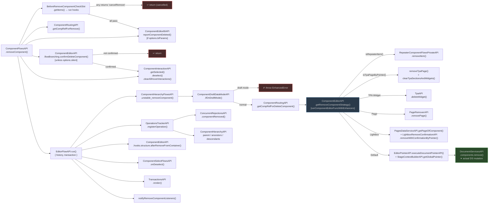

# removeComponent — Dependency Research

Entry point: `ComponentFlowsAPI.removeComponent()` in `editor-package-flows`.

---

## Mermaid Diagram



---

## Level 1 — ComponentFlowsAPI.removeComponent()

**File**: `editor-package-flows/src/apis/createComponentRemovingFlowsAPI.ts`

Two code paths controlled by `ExperimentalFlowsAPI.isInExperimentalFlow()`. The old path delegates entirely to `ComponentFlowsHooksAPI.getDeprecatedSlotContribution().removeComponentEditorFlowOldVariant()`. All detail below is the new (experimental) path.

### API Dependencies

| API | Methods | Purpose |
|---|---|---|
| `ExperimentalFlowsAPI` | `isInExperimentalFlow()` | Branch between new/old variant |
| `ComponentRoutingAPI` | `getCompRefForRemove()` | Resolve canonical comp refs |
| `BeforeRemoveComponentCheckSlot` | `getItems()` | Cancellation hooks — any returning `'cancelRemove'` aborts |
| `ComponentEditorBIAPI` | `sendComponentEvents()` | BI event via `reportComponentDeleted()` helper |
| `ComponentRemovingFlowsUtilsAPI` | `getDeleteComponentBIParamsEnrichers()` | BI enrichers |
| `PointerComparisonAPI` | `component.isSame()` | Comp ref equality |
| `ComponentEditorAPI` | `flowBranching.confirmDeleteComponent()` | Confirmation dialog (skipped if `options.silent`) |
| `ComponentEditorAPI` | `hooks.structure.beforeRemove()` | Lifecycle hook per component and per child |
| `ComponentEditorAPI` | `hooks.structure.removeFromContainer()` | Notify container of removal |
| `ComponentEditorAPI` | `hooks.structure.afterRemoveFromContainer()` | Post-removal container hook |
| `ComponentInteractionAPI` | `getSelected()`, `deselect()`, `clearAllHoverInteractions()` | Clear selection/hover |
| `EditorFlowAPI` | `run({ history, transaction })` | Wrap in history entry + transaction |
| `ComponentHierarchyAPI` | `OldBadPerformance.parent.unstable_get()` | Get parent |
| `ComponentHierarchyAPI` | `OldBadPerformance.ancestors.unstable_get()` | Get ancestors (for re-selection) |
| `ComponentHierarchyAPI` | `OldBadPerformance.children.unstable_getDescendants()` | Get descendants (to run beforeRemove on each) |
| `ComponentHierarchyFlowsAPI` | `unstable_removeComponent()` | **Actual structural removal** ↓ |
| `DocumentStructureAPI` | `doesComponentExist()` | Check if comp still exists post-removal |
| `OperationsTrackerAPI` | `registerOperation()` | Register as hierarchy operation |
| `ConcurrentRejectionsAPI` | `componentRemoved()` | Notify concurrent ops system |
| `TransactionsAPI` | `render()` | Trigger render |
| `ComponentSelectFlowsAPI` | `onDeselect()` | Re-select nearest surviving ancestor |
| `ComponentFlowsHooksAPI` | `getDeprecatedSlotContribution()` | Old variant entry point |

---

## Level 2 — ComponentHierarchyFlowsAPI.unstable_removeComponent()

**File**: `editor-package-hierarchy/src/apis/hierarchyAPI/componentHierarchyFlowsPrivateAPI/createComponentHierarchyFlowsPrivateAPI.ts`

**SlotKey**: `FLOWS` layer, public

A thin wrapper — resolves the right comp ref, then delegates entirely to a strategy function.

```typescript
const unstable_removeComponent = componentDraftDataModeAPI.ifOnDraftMode(
  (compRef) => { throw new EnhancedError('Can not remove component while in draft mode', ...) },
  async (compRef, options) => {
    const compToRemove = componentRoutingAPI.getCompRefForDeleteComponent(compRef)
    const removeFunction = componentEditorAPI.getRemoveComponentStrategy(compToRemove)
    await removeFunction(options)
  }
)
```

### API Dependencies

| API | Method | Purpose |
|---|---|---|
| `ComponentDraftDataModeAPI` | `ifOnDraftMode()` | Guard — throws if in draft mode |
| `ComponentRoutingAPI` | `getCompRefForDeleteComponent()` | Resolve ref for deletion |
| `ComponentEditorAPI` | `getRemoveComponentStrategy()` | **Returns the type-specific removal strategy** ↓ |

---

## Level 3 — ComponentEditorAPI.getRemoveComponentStrategy()

**Wrapper**: `editor-package-component-editor-api/src/createComponentEditorAPI.ts`

```typescript
getRemoveComponentStrategy(compRef) {
  return runComponentEditorFuncWithEnhancers(compRef, 'getRemoveComponentStrategy', () => [compRef])
}
```

Routes through the enhancer chain. Each enhancer gets first pick; the first matching branch wins.

### Strategy Branches

#### Branch 1 — Repeater Item
**File**: `editor-components-repeater/src/componentEditors/createRepeaterItemEditorEnhancer.tsx`

**Condition**: `isRepeaterItem(compRef)`

| API | Method |
|---|---|
| `RepeaterComponentFlowsPrivateAPI` | `removeItem(compRef, options)` |

#### Branch 2 — TPA Page
**File**: `editor-package-tpa/src/pages/enhancer/tpaPageComponentEditorEnhancer.ts`

**Condition**: `isPageComponent(compRef) && pagesDataServiceAPI.isTpaPageByPointer(compRef)`

| API | Method |
|---|---|
| `PagesDataServiceAPI` | `isTpaPageByPointer(compRef)` |
| *(local)* | `removeTpaPage(compRef, options)` |
| *(local)* | `clearTpaSectionsAndWidgets(compRef)` |

Falls back to default strategy if page is not a TPA page.

#### Branch 3 — TPA Widget
**File**: `editor-package-tpa/src/widget/tpaWidgetComponentEditor.ts`

**Condition**: Component type is TPA Widget

| API | Method |
|---|---|
| `TpaAPI` | `deleteWidget(compRef, options)` |

#### Branch 4 — Page
**File**: `editor-components-page/src/componentEditors/createPageComponentEditor.tsx`

**Condition**: Component type is Page

| API | Method |
|---|---|
| `PageRemoverAPI` | `removePage(compRef, options)` |

#### Branch 5 — Lightbox Container
**File**: `editor-package-lightbox/src/componentEditors/lightboxContainerEditor.tsx`

**Condition**: Component type is Lightbox Container

| API | Method |
|---|---|
| `PagesDataServiceAPI` | `getPageOfComponent(compRef)` |
| `LightboxRemoveConfirmationAPI` | `removeWithConfirmationByPointer(lightboxPage, options.origin)` |

#### Branch 6 — Default (all other components)
**File**: `editor-package-component-editors/src/createDefaultComponentEditor.tsx`

**Condition**: Fallback

| API | Method |
|---|---|
| `StageContextBuilderAPI` | `getGlobalPointer(compRef)` |
| `EditorPointerAPI` | `executeDocumentPointerAPI(pointer, { executeForDocumentPointer: ... }, 'identity')` |
| `DocumentServicesAPI` | `components.remove()` — **actual document model mutation** |

---

## Key Design Observations

1. **Cancellation slot** — `BeforeRemoveComponentCheckSlot` lets any registered hook veto removal before it starts.
2. **Silent mode** — `options.silent` skips the confirmation dialog entirely.
3. **Draft guard** — `unstable_removeComponent` throws immediately if called during draft mode.
4. **Strategy pattern via enhancer chain** — `getRemoveComponentStrategy` dispatches to 6 different implementations based on component type. All enhancers fall back down the chain for unrecognized types.
5. **`DocumentServicesAPI.components.remove`** is the only true document mutation — everything else is orchestration, hooks, and BI.
6. **Old variant** — the entire new flow is gated behind `ExperimentalFlowsAPI.isInExperimentalFlow()`. The old path goes through `ComponentFlowsHooksAPI` instead.
