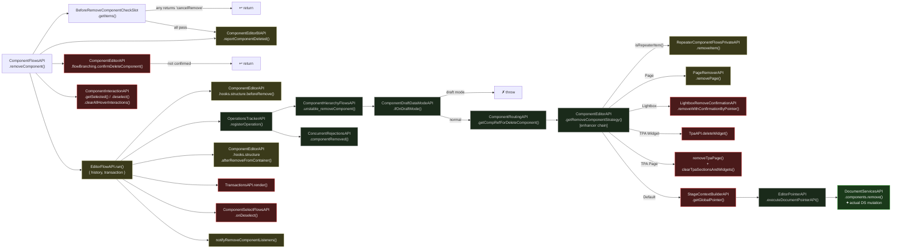

# removeComponent — Isomorphic Breaking Point Analysis

Analysis of `ComponentFlowsAPI.removeComponent()` against the isomorphic requirement:
core must be runnable on the server — no DOM, no browser APIs, no UI.

---

## Verdict

`removeComponent` as currently designed is **fundamentally a client-only flow**.

The document mutation at its core (`DocumentServicesAPI.components.remove`) is isomorphic, but it is buried under UI orchestration that cannot run on the server: confirmation dialogs, selection clearing, hover state, BI reporting, and render triggers.

---

## Flow Diagram



**Legend:**
- 🔴 Red — client-only, definitely breaking
- 🟡 Yellow — ambiguous, depends on contributed implementations
- ⬛ Grey — isomorphic, safe
- 🟢 Green — isomorphic core (target)

**Always red categories:**
- DOM measurements — `ComponentMeasureAPI`, `MockComponentMeasureAPI`, etc.
- Editor UI — `PanelsAPI`, `ComponentInteractionAPI`, etc.
- Editor state — `ComponentEditorStateAPI`, etc.
- Stage / Preview logic — `StageContextBuilderAPI`, `PreviewDisplayAPI`, etc.

---

## Breaking Point Map

### Direct dependencies of `removeComponent()`

| API | Breaking? | Reason |
|---|---|---|
| `ComponentEditorAPI.flowBranching.confirmDeleteComponent()` | ✗ Breaking | Editor UI — dialog |
| `ComponentInteractionAPI.getSelected()` | ✗ Breaking | Editor UI |
| `ComponentInteractionAPI.deselect()` | ✗ Breaking | Editor UI |
| `ComponentInteractionAPI.clearAllHoverInteractions()` | ✗ Breaking | Editor UI |
| `ComponentSelectFlowsAPI.onDeselect()` | ✗ Breaking | Editor UI |
| `TransactionsAPI.render()` | ✗ Breaking | Triggers a browser render |
| `ComponentEditorBIAPI.sendComponentEvents()` | ⚠️ Potentially | BI can be sent server-side; depends on whether the specific event data requires browser context |
| `BeforeRemoveComponentCheckSlot.getItems()` | ⚠️ Potentially | Contributions come from any package — some hooks will be browser-specific |
| `ComponentEditorAPI.hooks.structure.beforeRemove()` | ⚠️ Potentially | Contributed hooks — unknown isomorphicity per contributor |
| `ComponentEditorAPI.hooks.structure.removeFromContainer()` | ⚠️ Potentially | Same |
| `ComponentEditorAPI.hooks.structure.afterRemoveFromContainer()` | ⚠️ Potentially | Same |
| `EditorFlowAPI.run()` | ⚠️ Potentially | History/undo stack may depend on client state |
| `ComponentRoutingAPI.getCompRefForRemove()` | ✓ OK | Pointer resolution — pure document model |
| `PointerComparisonAPI.component.isSame()` | ✓ OK | Pure comparison |
| `ComponentHierarchyAPI` (traversal) | ✓ OK | Document tree traversal — no DOM |
| `DocumentStructureAPI.doesComponentExist()` | ✓ OK | Document model query |
| `OperationsTrackerAPI.registerOperation()` | ✓ Probably | Operation tracking — likely pure state |
| `ConcurrentRejectionsAPI.componentRemoved()` | ✓ Probably | Concurrent ops notification — likely pure state |

### Strategy branches of `getRemoveComponentStrategy()`

| Branch | Breaking? | Reason |
|---|---|---|
| Default → `StageContextBuilderAPI.getGlobalPointer()` | ✗ Breaking | Stage/Preview logic — always client-only |
| Default → `EditorPointerAPI.executeDocumentPointerAPI()` | ✓ OK | Pointer dispatch — isomorphic |
| Default → `DocumentServicesAPI.components.remove()` | ✓ OK | Pure document mutation — isomorphic |
| Repeater Item → `RepeaterComponentFlowsPrivateAPI.removeItem()` | ⚠️ Unknown | Needs separate tracing |
| Page → `PageRemoverAPI.removePage()` | ⚠️ Likely | Page removal involves navigation/UI flows |
| Lightbox → `LightboxRemoveConfirmationAPI.removeWithConfirmationByPointer()` | ✗ Breaking | Confirmation dialog — UI |
| TPA Widget → `TpaAPI.deleteWidget()` | ✗ Breaking | TPA runtime is client-only |
| TPA Page → `removeTpaPage()` + `clearTpaSectionsAndWidgets()` | ✗ Breaking | TPA + page = client-only |

---

## Structural Diagnosis

The flow has three distinct concern layers **mixed together**:

```
removeComponent()
├── [CLIENT ONLY]  Confirmation dialog
├── [CLIENT ONLY]  BI reporting
├── [CLIENT ONLY]  Selection / hover / interaction clearing
├── [CLIENT ONLY]  Render trigger
├── [AMBIGUOUS]    Before/after hooks (contributed, unknown isomorphicity per package)
├── [AMBIGUOUS]    EditorFlowAPI history/transaction
└── [ISOMORPHIC]   Document mutation
    ├── ComponentRoutingAPI
    ├── ComponentHierarchyAPI (traversal)
    ├── ComponentHierarchyFlowsAPI.unstable_removeComponent()
    └── DocumentServicesAPI.components.remove()
```

The isomorphic part is a small, clean subset at the bottom of the chain.

---

## Proposed Client/Server Split

Following Core Rules — Rule 6: core APIs can have a client/server split.

### Server part (isomorphic core)

```
removeComponent_server(compRefs, options)
  → ComponentRoutingAPI.getCompRefForDeleteComponent()
  → ComponentHierarchyAPI (traverse descendants for hook dispatch)
  → ComponentEditorAPI.hooks.structure.beforeRemove()   [isomorphic hooks only]
  → ComponentHierarchyFlowsAPI.unstable_removeComponent()
      → DocumentServicesAPI.components.remove()
  → ComponentEditorAPI.hooks.structure.afterRemoveFromContainer()  [isomorphic hooks only]
```

### Client part (browser extensions)

```
removeComponent_client(compRefs, options)
  → BeforeRemoveComponentCheckSlot        [includes client-only hooks]
  → ComponentEditorBIAPI                  [BI reporting]
  → ComponentEditorAPI.flowBranching.confirmDeleteComponent()   [dialog]
  → ComponentInteractionAPI               [clear selection/hover]
  → EditorFlowAPI.run()                   [wraps server call + client orchestration]
      → removeComponent_server()
      → TransactionsAPI.render()
      → ComponentSelectFlowsAPI.onDeselect()
      → notifyRemoveComponentListeners()
```

---

## Key Takeaways

**1. `confirmDeleteComponent()` is the hardest blocker.**
It is a UI dialog baked into the middle of the flow, not at the edges. On the server it would be skipped entirely, but its current placement requires restructuring the call sequence, not just wrapping it.

**2. The hook system is the deepest structural risk.**
`beforeRemove` / `afterRemoveFromContainer` hooks are contributed by dozens of packages. Each contributor would need to declare whether their hook is isomorphic. This mirrors the root-cause pattern from the Isomorphic Conflicts analysis — `PreviewAPI` being contributed into hooks is what caused 161 out of 205 conflicts.

**3. `DocumentServicesAPI.components.remove()` is already the right primitive.**
The isomorphic core exists — it's just buried. This aligns with the Core Rules finding that SITE / DATA_SERVICE layer APIs are the natural core boundary.

**4. All strategy branches except Default are client-only.**
On the server, component removal would only ever follow the Default branch (pure document mutation). Lightbox, TPA, Page, and Repeater branches are inherently UI/client flows and would need to live in the client part.
