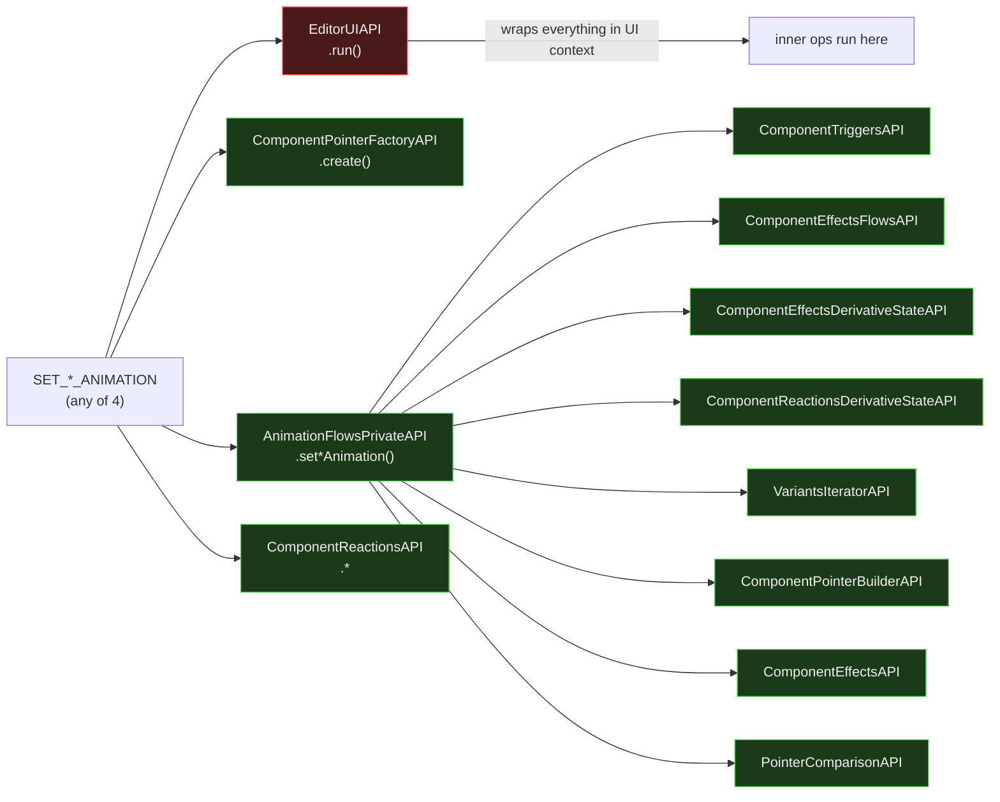

# Site Optimizer Animation Actions — Isomorphic Analysis

Entry point: `SiteOptimizerAnimationEntryPoint` in `odeditor-packages` (Harmony).

Actions: `SET_ENTRANCE_ANIMATION`, `SET_LOOP_ANIMATION`, `SET_MOUSE_EFFECT_ANIMATION`, `SET_SCROLL_ANIMATION`

---

## Verdict

All four animation actions are **structurally identical** — one RED wrapper around a fully
GREEN core. The document mutations are isomorphic; the `EditorUIAPI` wrapper is the sole blocker.

---

## Flow Diagram



---

## Breaking Point Map

| API | Method | Verdict | Reason |
|---|---|---|---|
| `EditorUIAPI` | `.run()` | ✗ RED | Editor UI layer — wraps ops in UI context, handles UI refresh |
| `ComponentPointerFactoryAPI` | `.create()` | ✓ GREEN | Pointer creation — pure data |
| `AnimationFlowsPrivateAPI` | `.set*Animation()` | ✓ GREEN | All 9 L2 deps are GREEN (see below) |
| `ComponentReactionsAPI` | various | ✓ GREEN | Reactions data — no DOM |

### AnimationFlowsPrivateAPI L2 deps (all GREEN)

| Dep | Verdict |
|---|---|
| `ComponentTriggersAPI` | ✓ GREEN |
| `ComponentEffectsFlowsAPI` | ✓ GREEN |
| `ComponentReactionsDerivativeStateAPI` | ✓ GREEN |
| `ComponentEffectsDerivativeStateAPI` | ✓ GREEN |
| `VariantsIteratorAPI` | ✓ GREEN |
| `ComponentReactionsAPI` | ✓ GREEN |
| `PointerComparisonAPI` | ✓ GREEN |
| `ComponentPointerBuilderAPI` | ✓ GREEN |
| `ComponentEffectsAPI` | ✓ GREEN |

---

## Solution

### Remove `EditorUIAPI.run()` wrapper

**Problem:** Each action wraps its logic in `EditorUIAPI.run()` which manages UI context
(deferred notifications, editor refresh). This is a client-only operation.

**Solution:** Run the animation flows directly without the `EditorUIAPI` wrapper.
Use `TransactionsAPI` for atomicity if needed — `TransactionsAPI` is isomorphic.
`AnimationFlowsPrivateAPI` and all its deps are GREEN and require no changes.

**Impact:** Zero changes to core animation logic. Only the entry-point wrapper changes.

**Effort:** Minimal — remove/replace one `.run()` call per action (4 total, identical pattern).

---

## Structural Diagnosis

```
SET_*_ANIMATION
├── ✗ RED   EditorUIAPI.run()          ← remove wrapper (solution above)
├── ✓ GREEN ComponentPointerFactoryAPI
├── ✓ GREEN AnimationFlowsPrivateAPI   ← all 9 L2 deps GREEN
└── ✓ GREEN ComponentReactionsAPI
```

The isomorphic core is **100% ready** — only the outermost wrapper needs removal.
