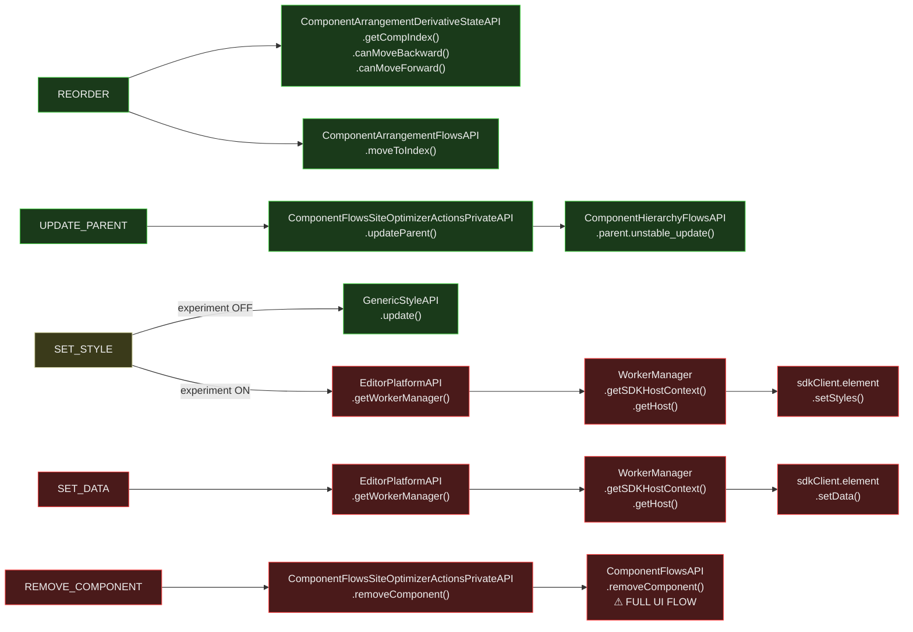

# Site Optimizer Component Flows Actions — Isomorphic Analysis

Entry point: `componentFlowsSiteOptimizerActionsEntryPoint` in `responsive-editor-packages` (REP).

**File:** `packages/editor-package-flows/src/entrypoints/componentFlowsSiteOptimizerActionsEntryPoint.ts`

Actions: `REMOVE_COMPONENT`, `UPDATE_PARENT`, `SET_STYLE`, `SET_DATA`, `REORDER`

---

## Verdicts at a Glance

| Action | Verdict | Blocker |
|---|---|---|
| REORDER | ✓ GREEN | None — both deps are GREEN |
| UPDATE_PARENT | ✓ GREEN | None — uses targeted hierarchy API |
| SET_STYLE | ⚠️ ORANGE | SDK path via `EditorPlatformAPI`; legacy `GenericStyleAPI` path is GREEN |
| SET_DATA | ✗ RED | Always uses SDK path via `EditorPlatformAPI` |
| REMOVE_COMPONENT | ✗ RED | Calls the **full UI-wrapped** `ComponentFlowsAPI.removeComponent()` |

---

## Flow Diagram

---

## Breaking Point Map

### REORDER — GREEN

| API | Method | Verdict |
|---|---|---|
| `ComponentArrangementDerivativeStateAPI` | `getCompIndex()`, `canMoveBackward()`, `canMoveForward()` | ✓ GREEN |
| `ComponentArrangementFlowsAPI` | `moveToIndex(targetRef, targetIndex)` | ✓ GREEN |

No blockers. REORDER is server-ready today.

---

### UPDATE_PARENT — GREEN

| API | Method | Verdict |
|---|---|---|
| `ComponentFlowsSiteOptimizerActionsPrivateAPI` | `updateParent()` | ✓ GREEN |
| `ComponentHierarchyFlowsAPI` | `parent.unstable_update(parentRef, [targetRef])` | ✓ GREEN |

Targeted hierarchy mutation — no UI, no DOM, no measurement. Server-ready today.

---

### SET_STYLE — ORANGE (experiment-gated)

Gated on `specs.responsive-editor.Ai2WixSetStylePlatfomSDK`:

| Path | API | Method | Verdict |
|---|---|---|---|
| **Legacy (experiment OFF)** | `GenericStyleAPI` | `update(targetRef, style)` | ✓ GREEN |
| **SDK (experiment ON)** | `EditorPlatformAPI` | `getWorkerManager()` | ✗ RED |
| SDK chain | `WorkerManager` | `getSDKHostContext({ editorPointers })` | ✗ RED |
| SDK chain | `sdkClient.element` | `setStyles(style)` | ✗ RED |

**Server path:** Force the GenericStyleAPI path. Either gate on server context instead of
experiment, or call `GenericStyleAPI.update()` directly on the server.

The data transformation (filter empty props, `cssCustomProperties: true → 'block'`) is pure
logic that can be kept on both paths.

---

### SET_DATA — RED

Always uses the SDK path — no fallback.

| API | Method | Verdict | Reason |
|---|---|---|---|
| `EditorPlatformAPI` | `getWorkerManager()` | ✗ RED | Browser Web Workers |
| `WorkerManager` | `getSDKHostContext()`, `getHost()` | ✗ RED | Client-side SDK host context |
| `sdkClient.element` | `setData(dataToUpdate)` | ✗ RED | Requires worker + host context |

**Solution:** Create a server-side SDK host context that doesn't require a WorkerManager.
Call the data update operation directly without the browser worker chain.

---

### REMOVE_COMPONENT — RED (surprise)

Despite the site-optimizer action appearing "simple", the private API wrapper calls the
**full UI-heavy** `ComponentFlowsAPI.removeComponent()` — the same flow analyzed in
`REMOVE_COMPONENT_ISOMORPHIC_ANALYSIS.md` which includes confirmation dialogs,
selection clearing, hover clearing, and render triggers.

| API | Method | Verdict | Reason |
|---|---|---|---|
| `ComponentFlowsSiteOptimizerActionsPrivateAPI` | `removeComponent()` | ✗ RED | Delegates to full UI flow |
| `ComponentFlowsAPI` | `removeComponent([targetRef])` | ✗ RED | Confirmation dialog, selection clearing, render — see REMOVE_COMPONENT analysis |

**Solution:** Replace the private API's implementation to call
`ComponentHierarchyFlowsAPI.unstable_removeComponent()` directly (the isomorphic subset
already identified in `REMOVE_COMPONENT_ISOMORPHIC_ANALYSIS.md`). The site-optimizer
context doesn't need the confirmation dialog or selection management — it's a programmatic
mutation, not a user gesture.

---

## Key Takeaways

1. **REORDER and UPDATE_PARENT are ready today** — no changes needed.
2. **REMOVE_COMPONENT is a misleading GREEN** in the dependency graph — it's RED because
   `ComponentFlowsSiteOptimizerActionsPrivateAPI.removeComponent()` calls the full UI flow.
   The fix is a one-line change in the private API to use `unstable_removeComponent` instead.
3. **SET_STYLE has an easy server path** — the GenericStyleAPI path already exists and is GREEN.
   Server execution should bypass the SDK experiment toggle.
4. **SET_DATA and the SDK pattern** are the biggest architectural challenge — they require a
   server-side SDK host implementation, shared with SET_PRESET.
