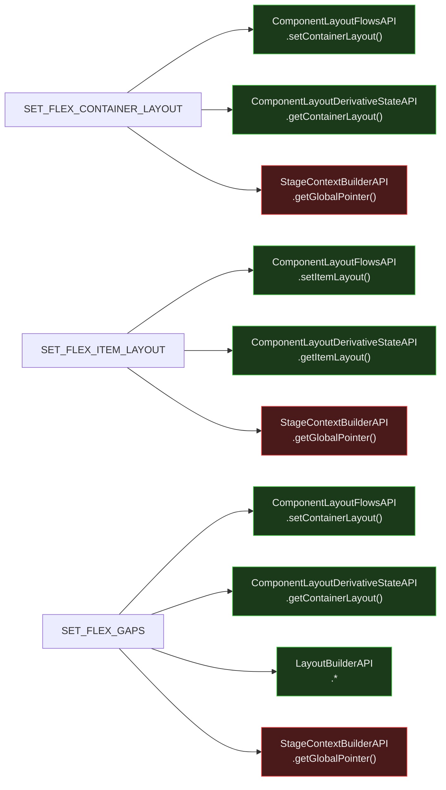

# Site Optimizer Flex Layout Actions — Isomorphic Analysis

Entry point: `flexSiteOptimizerEntryPoint` in `responsive-editor-packages` (REP).

Actions: `SET_FLEX_CONTAINER_LAYOUT`, `SET_FLEX_ITEM_LAYOUT`, `SET_FLEX_GAPS`

---

## Verdict

All three flex actions are **one step away from server-ready**. The only blocker is
`StageContextBuilderAPI` — identical to the blocker in the add component flow.
The server-safe stub solution (Solution 1 from addComponent analysis) unblocks all three at once.

---

## Flow Diagram



---

## Breaking Point Map

| API | Method | Verdict | Reason |
|---|---|---|---|
| `ComponentLayoutFlowsAPI` | `setContainerLayout()`, `setItemLayout()` | ✓ GREEN | Layout mutations — document model |
| `ComponentLayoutDerivativeStateAPI` | `getContainerLayout()`, `getItemLayout()` | ✓ GREEN | Layout reads — no DOM |
| `LayoutBuilderAPI` | *(construction)* | ✓ GREEN | Pure layout computation |
| `StageContextBuilderAPI` | `getGlobalPointer()` | ✗ RED | Stage/Preview — resolves the active variant context |

### What `StageContextBuilderAPI.getGlobalPointer()` does

Resolves the component ref to include the currently active variant/breakpoint context,
so layout updates target the right variant. On the server there is no "active breakpoint" —
the server operates on bare (contextless) refs.

---

## Solution

**Server-safe `StageContextBuilderAPI` stub** (same as addComponent Solution 1):

Provide a server implementation where `getGlobalPointer(compRef)` returns `compRef`
unchanged (identity function). The server operates on bare refs — no breakpoint
context to inject. This is correct: on the server, layout mutations apply to the
base layout, not a specific variant's override.

**Impact:** All three flex actions become fully server-ready with zero changes to
their actual layout logic.

**Effort:** Minimal — one stub, no changes to callers. Shared with addComponent
solution (same `StageContextBuilderAPI` stub fixes both).

---

## Structural Diagnosis

```
SET_FLEX_CONTAINER_LAYOUT / SET_FLEX_ITEM_LAYOUT / SET_FLEX_GAPS
├── ✗ RED   StageContextBuilderAPI.getGlobalPointer()  ← server-safe stub (shared fix)
├── ✓ GREEN ComponentLayoutFlowsAPI
├── ✓ GREEN ComponentLayoutDerivativeStateAPI
└── ✓ GREEN LayoutBuilderAPI  (SET_FLEX_GAPS only)
```

Once the `StageContextBuilderAPI` stub is in place, these three actions require
**no further migration work**.

---

## `editorFlowAPI.contributePlugin` — Layout-Topic Plugins

`EditorFlowAPI` is **not** in the deps of `flexSiteOptimizerEntryPoint`, so these actions likely do not call `EditorFlowAPI.run()` directly. Layout-topic plugins would not fire.

If the actions are ever called from within an `EditorFlowAPI.run()` context higher up the call stack, the following `['layout']`-topic plugins would trigger (all RED or ORANGE, all document-model-safe to skip on server):

| Plugin | Repo | Classification |
|--------|------|---------------|
| AutoGrid layout recalculation | Harmony | ✗ RED — `ComponentMeasureAPI` + `StageContextBuilderAPI` |
| AutoDOM render-order reordering | Harmony | ✗ RED — `AutoDOMOrderFlowsAPI` → `ComponentMeasureAPI` |
| AutoDOM render-order reordering | REP | ✗ RED — same chain |
| Mesh layout freeze + margin fix (critical¹) | REP | ✗ RED — `MeshLayoutAPI`, layout mutation |
| Section Fixer integrity check | REP | ⚠️ ORANGE — `ComponentEditorAPI.hasSectionBehaviors()`, `PagesDataServiceAPI` |
| Content max-width snackbar | REP | ✗ RED — UI notification, no document mutation |

> ¹ Registered with `shouldRollbackOnFailure=true` — runs before the transaction.
