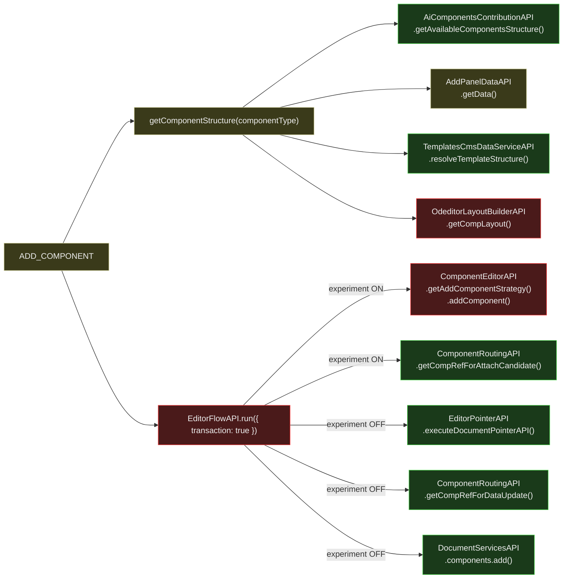

# Site Optimizer ADD_COMPONENT Action — Isomorphic Analysis (Harmony)

Entry point: `siteOptimizerActionsContributorEntryPoint` in `odeditor-packages` (Harmony).

**File:** `packages/odeditor-package-site-optimizer-actions/src/features/siteOptimizerActionsContributor/apis/siteOptimizerActionsContributorEntryPoint.ts` (lines 117–166)

> **Note:** This is the *site-optimizer action* entry point — a thin orchestration layer.
> The underlying `unstable_addComponent` flow (REP) is analyzed separately in
> `ADD_COMPONENT_ISOMORPHIC_ANALYSIS.md`. This action takes a different path: the
> experiment-OFF branch calls `DocumentServicesAPI.components.add()` directly, bypassing
> the full `unstable_addComponent` complexity.

---

## Verdict

**ORANGE** — the core document mutation (experiment OFF, without the `EditorFlowAPI`
wrapper) is nearly server-ready. Two blockers prevent immediate use:

1. `EditorFlowAPI.run()` wraps the entire action — it is **RED** (deprecated alias for
   `EditorUIAPI`, which is client-only).
2. `AddPanelDataAPI.getData()` in `getComponentStructure()` — **ORANGE** (panel-layer data).

The experiment-ON path adds `ComponentEditorAPI` (**RED**) as an additional blocker.

---

## Flow Diagram



---

## Breaking Point Map

### L1 APIs (action handler)

| API | Method | Verdict | Reason |
|---|---|---|---|
| `EditorFlowAPI` | `.run({ transaction: true })` | ✗ RED | Deprecated wrapper for `EditorUIAPI` — client-only UI context |
| `ComponentEditorAPI` *(experiment ON)* | `.getAddComponentStrategy().addComponent()` | ✗ RED | Extends `UiBehaviorsStageAPI` + `UiBehaviorsWorkspaceAPI` — Stage/Preview + Editor UI |
| `ComponentRoutingAPI` | `.getCompRefForAttachCandidate()`, `.getCompRefForDataUpdate()` | ✓ GREEN | Ref resolution — no DOM |
| `EditorPointerAPI` | `.executeDocumentPointerAPI()` | ✓ GREEN | Pointer execution — document model |
| `DocumentServicesAPI` | `.components.add()` | ✓ GREEN | Core document mutation |
| `ExperimentsAPI` | `.enabled()` | ✓ GREEN | Feature flags |

### `getComponentStructure()` helper

| API | Method | Verdict | Reason |
|---|---|---|---|
| `AiComponentsContributionAPI` | `.getAvailableComponentsStructure()` | ✓ GREEN | AI data registry |
| `AddPanelDataAPI` | `.getData()` | ⚠️ ORANGE | `DERIVATIVE_STATE` layer (Harmony). `getData()` itself is clean — reads in-memory state, no browser APIs. Entry point declares `PanelsAPI` (client-only), preventing it from loading on server. State is populated from a client-side CMS fetch so `getData()` returns `null` on server. Returns `null` gracefully; code falls through to `OdeditorLayoutBuilderAPI` (RED) as final fallback. |
| `TemplatesCmsDataServiceAPI` | `.resolveTemplateStructure()` | ✓ GREEN | CMS data layer |
| `OdeditorLayoutBuilderAPI` | `.getCompLayout()` | ✗ RED | Depends on `StageContextBuilderAPI` (Stage/Preview) |

---

## Solution

### 0. `getComponentStructure()` fallback chain

The helper has a 3-step priority chain:

```
1. aiComponentsContributionAPI.getAvailableComponentsStructure()[type]  → GREEN (if present)
2. addPanelDataAPI.getData() → fetchTemplatesByComponentType()
   → templatesCmsDataServiceAPI.resolveTemplateStructure()               → GREEN (if template found)
3. { componentType, layouts: odeditorLayoutBuilderAPI.getCompLayout() }  → RED
```

If the site-optimizer always uses component types registered in the AI contribution
registry (step 1), neither `AddPanelDataAPI` nor `OdeditorLayoutBuilderAPI` is reached.
The RED fallback only fires when the component type is unknown to all registries.

---

### 1. Replace `EditorFlowAPI.run()` with `TransactionsAPI`

**Problem:** `EditorFlowAPI` is a deprecated thin wrapper over `EditorUIAPI`, adding
UI notification deferral on top. It wraps the entire action body.

**Solution:** Replace with `TransactionsAPI.run()` directly — `TransactionsAPI` is GREEN
and provides the same transactional semantics without the UI context overhead.

Same pattern as the animation actions fix. Effort: **minimal**.

### 2. Eliminate `OdeditorLayoutBuilderAPI` from `getComponentStructure()`

**Problem:** `getCompLayout()` resolves a layout for the new component based on the
stage context (current variant/breakpoint). On the server there is no active stage.

**Solution:** The site-optimizer caller already knows the target layout. Pass the layout
directly in the action parameters instead of computing it via stage context. The data
transformation itself is pure — only the context lookup is client-bound.

### 3. Experiment-OFF path becomes GREEN (after fixes 1+2)

With `EditorFlowAPI` replaced and `OdeditorLayoutBuilderAPI` bypassed, the OFF path
reduces to:

```
ComponentRoutingAPI (GREEN)
  → EditorPointerAPI (GREEN)
  → DocumentServicesAPI.components.add() (GREEN)
```

`AddPanelDataAPI.getData()` remains ORANGE — if panel data can be resolved server-side
or bypassed (structure passed from caller), the full OFF path becomes GREEN.

### 4. Experiment-ON path: needs `ComponentEditorAPI` server split

The ON path delegates to `componentEditorAPI.getAddComponentStrategy()` which extends
UI behavior APIs. This requires a server-safe `ComponentEditorAPI` that exposes
`getAddComponentStrategy()` without UI behavior dependencies.

**Effort:** High — `ComponentEditorAPI` has a large surface area.

---

## Path-by-Path Summary

| Path | Condition | Current | After Fix 1+2 | After All Fixes |
|---|---|---|---|---|
| **Experiment OFF** | Default (no flag) | RED (EditorFlowAPI) | ORANGE (AddPanelDataAPI) | GREEN |
| **Experiment ON** | `specs.responsive-editor.addActionByEditorCode` | RED | RED (ComponentEditorAPI) | ORANGE/RED |

---

## `editorFlowAPI.contributePlugin` — Add-Topic Plugins

This action is wrapped in `EditorFlowAPI.run()`, so all `['add']`-topic plugins fire around the transaction. Both repos contribute add-topic plugins (full detail in `ADD_COMPONENT_ISOMORPHIC_ANALYSIS.md`):

| Plugin | Repo | Classification |
|--------|------|---------------|
| AutoGrid layout recalculation | Harmony | ✗ RED — `ComponentMeasureAPI` + `StageContextBuilderAPI` |
| AutoDOM render-order reordering | Harmony | ✗ RED — `AutoDOMOrderFlowsAPI` → `ComponentMeasureAPI` |
| Component selection on add | REP | ✗ RED — `ComponentSelectFlowsAPI` (UI selection) |
| Set last added component | REP | ✗ RED — `ComponentInteractionAPI` + `StageContextBuilderAPI` |
| AutoDOM render-order reordering | REP | ✗ RED — same chain as Harmony |

All 5 are RED — correctly skipped when `EditorFlowAPI.run()` is replaced with `TransactionsAPI.run()` (Solution 1). AutoGrid's layout recalculation is already addressed by Solution 2 (caller provides layout).

---

## Key Takeaways

1. **The experiment-OFF path is the easy win** — with EditorFlowAPI replaced and layout
   passed from caller, this path has a clear path to GREEN.
2. **`OdeditorLayoutBuilderAPI` is an easy bypass** — the caller can provide layout
   instead of computing it from stage context.
3. **The experiment-ON path requires significant work** — `ComponentEditorAPI` is deeply
   coupled to UI behaviors and is not a quick fix.
4. **This action is simpler than `unstable_addComponent`** — no hook infrastructure, no
   `AfterAddComponentSlot`, no measurement-based layout sync. The path to server-ready
   is shorter here.
5. **All add-topic plugins are RED** — replacing `EditorFlowAPI.run()` with `TransactionsAPI.run()` correctly skips them.
