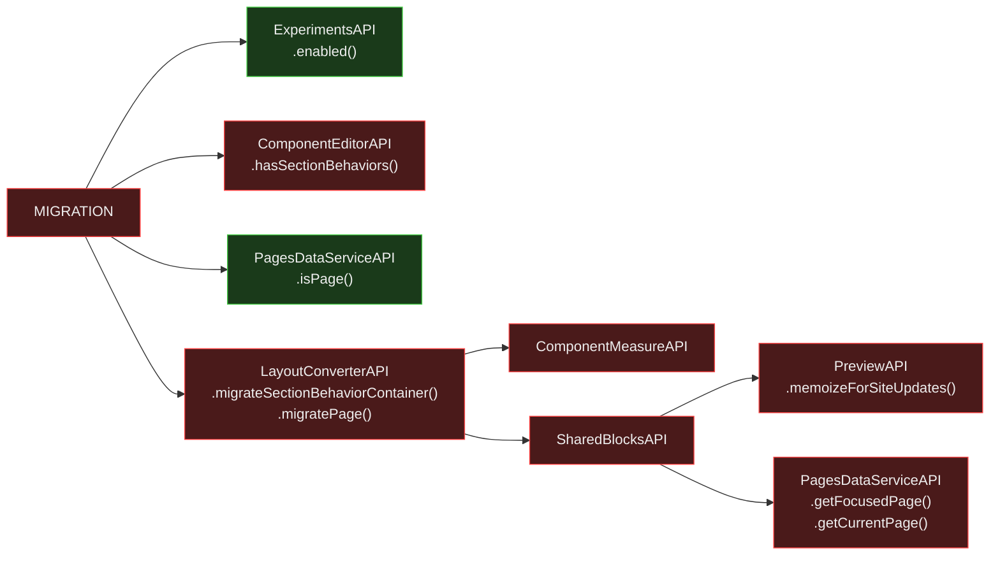

# Site Optimizer MIGRATION Action — Isomorphic Analysis

Entry point: `siteOptimizerActionsContributorEntryPoint` in `odeditor-packages` (Harmony).

**File:** `packages/odeditor-package-site-optimizer-actions/src/features/siteOptimizerActionsContributor/apis/siteOptimizerActionsContributorEntryPoint.ts` (lines 168–199)

---

## Verdict

**RED** — `LayoutConverterAPI` is the core dependency and it is RED.
The gating logic (experiment check + target type check) is fully isomorphic,
but the actual migration operations are not.

**New reclassification:** `SharedBlocksAPI` is listed as GREEN in the dependency graph
but is actually **RED** — it uses forbidden DS operations and `PreviewAPI`.
This adds a second RED root cause to `LayoutConverterAPI`.

---

## Flow Diagram

---

## Breaking Point Map

### L1 APIs

| API | Method | Verdict | Reason |
|---|---|---|---|
| `ExperimentsAPI` | `.enabled()` | ✓ GREEN | Feature flags — no DOM |
| `PagesDataServiceAPI` | `.isPage(targetRef)` | ✓ GREEN | Not in forbidden DS ops list |
| `ComponentEditorAPI` | `.hasSectionBehaviors(targetRef)` | ✗ RED | Extends `UiBehaviorsStageAPI` — Stage/Preview layer |
| `LayoutConverterAPI` | `.migrateSectionBehaviorContainer()`, `.migratePage()` | ✗ RED | Depends on `ComponentMeasureAPI` + `SharedBlocksAPI` (both RED) |

### `LayoutConverterAPI` L2 deps (RED)

| Dep | Verdict | Reason |
|---|---|---|
| `ComponentMeasureAPI` | ✗ RED | DOM measurement — `getBoundingBox()` |
| `SharedBlocksAPI` | ✗ RED | **Reclassified** — see below |

### `SharedBlocksAPI` — Reclassification (GREEN → RED)

The dependency graph lists `SharedBlocksAPI` as GREEN, but it uses:

| Call | Verdict | Reason |
|---|---|---|
| `pagesDataServiceAPI.getFocusedPage()` | ✗ RED | Forbidden DS operation |
| `pagesDataServiceAPI.getCurrentPage()` | ✗ RED | Forbidden DS operation |
| `previewAPI.memoizeForSiteUpdates()` | ✗ RED | `PreviewAPI` — browser/iframe only |

**Corrected verdict: `SharedBlocksAPI` is RED.** It cannot run on the server.

---

## Solution

### Server-side migration path

**Problem:** Migration is conceptually a schema transformation — rewriting layout data
from one format to another. The current implementation couples this to DOM measurements
(to infer positions during migration) and shared-block lookups (via forbidden DS ops).

**Proposed approach:**

- **Measurement coupling:** The migration could accept explicit position data as input
  parameters instead of measuring from the DOM. The site-optimizer caller already has
  layout information — it could provide it.

- **SharedBlocksAPI coupling:** A server-safe `SharedBlocksAPI` that uses allowed DS
  operations (`pages.get()`, `pages.getAll()`) instead of forbidden focused/current
  page lookups would unblock this path.

- **ComponentEditorAPI.hasSectionBehaviors():** Either extract this check into a
  standalone data-layer predicate, or move the type detection to the caller level
  (the site-optimizer caller likely already knows if the target is a section or page).

**Effort:** High — `LayoutConverterAPI` has 21 L2 deps and the measurement coupling
is deep. A minimal fix that unblocks the server path would require:

1. Refactoring `SharedBlocksAPI` to not use forbidden DS operations (medium effort)
2. Threading position data through the migration flow (medium effort)
3. Extracting `hasSectionBehaviors()` from `ComponentEditorAPI` (low effort)

---

## Key Takeaways

1. **The gating logic is clean** — experiment check + `isPage()` check are both GREEN.
   The blocker is entirely in the migration implementation, not the action structure.
2. **`SharedBlocksAPI` is a new RED reclassification** — the dependency graph is wrong
   here. Any analysis that treats SharedBlocksAPI as GREEN should be revised.
3. **`ComponentEditorAPI.hasSectionBehaviors()`** — the method name suggests a pure
   predicate (does this component have section behaviors?), but it lives in an API
   that extends UI behavior layers. Worth investigating if the implementation itself
   touches DOM/stage, or if it's purely a data check that could be extracted.
4. **Migration is the hardest site-optimizer action to server-port** — it requires
   the most architectural changes (LayoutConverterAPI refactor + SharedBlocksAPI fix).
