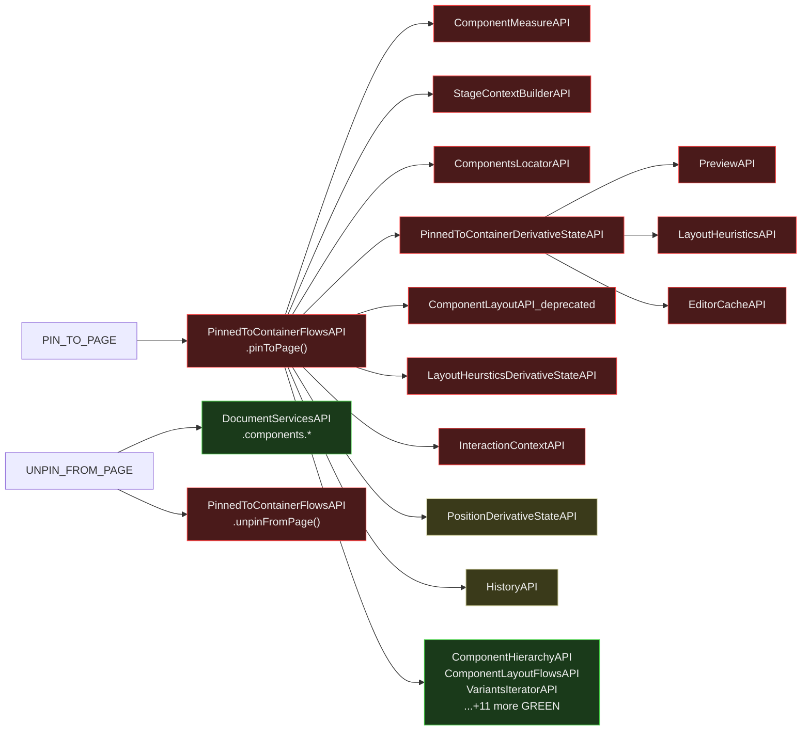

# Site Optimizer PIN_TO_PAGE / UNPIN_FROM_PAGE — Isomorphic Analysis

Entry point: `siteOptimizerActionsContributorEntryPoint` in `odeditor-packages` (Harmony).

Actions: `PIN_TO_PAGE`, `UNPIN_FROM_PAGE`

---

## Verdict

Both actions are **blocked by `PinnedToContainerFlowsAPI`** which depends on 10+ RED APIs.
The *concept* of pinning/unpinning is isomorphic (it's a document model property), but the
current implementation is heavily tied to DOM measurements, stage context, and editor UI state.

---

## Flow Diagram



---

## Breaking Point Map

### PIN_TO_PAGE

| API | Method | Verdict | Reason |
|---|---|---|---|
| `PinnedToContainerFlowsAPI` | `pinToPage()` | ✗ RED | Depends on 10+ RED APIs (see table below) |

### UNPIN_FROM_PAGE

| API | Method | Verdict | Reason |
|---|---|---|---|
| `DocumentServicesAPI` | `.components.*` | ✓ GREEN | Core document mutation |
| `PinnedToContainerFlowsAPI` | `unpinFromPage()` | ✗ RED | Same API as above |

### PinnedToContainerFlowsAPI — L2 dependency breakdown

| Dep | Verdict | Reason |
|---|---|---|
| `ComponentMeasureAPI` | ✗ RED | DOM measurement |
| `StageContextBuilderAPI` | ✗ RED | Stage/Preview |
| `ComponentsLocatorAPI` | ✗ RED | `getCompRefsFromPoint(Point)` — viewport pixel coords |
| `PinnedToContainerDerivativeStateAPI` | ✗ RED | Depends on `PreviewAPI` + `LayoutHeuristicsAPI` + `EditorCacheAPI` |
| `ComponentLayoutAPI_deprecated` | ✗ RED | Deprecated — must not exist on server |
| `LayoutHeursticsDerivativeStateAPI` | ✗ RED | Measurement-based heuristics |
| `InteractionContextAPI` | ✗ RED | *(see note below)* |
| `PositionDerivativeStateAPI` | ⚠️ ORANGE | `getPosition()` OK; `canSetStickyPosition()` may need measurements |
| `HistoryAPI` | ⚠️ ORANGE | Server-compatible; needs verification of specific methods used |
| `ComponentEditorBIAPI` | ⚠️ ORANGE | BI OK on server; dep has `PreviewAPI` |
| `ComponentHierarchyAPI` | ✓ GREEN | |
| `ComponentHierarchyFlowsAPI` | ✓ GREEN | |
| `ComponentLayoutFlowsAPI` | ✓ GREEN | |
| `ComponentsDerivativeStateAPI` | ✓ GREEN | |
| `ComponentArrangementDerivativeStateAPI` | ✓ GREEN | |
| `ComponentArrangementFlowsAPI` | ✓ GREEN | |
| `UnitOfWorkFlowAPI` | ✓ GREEN | |
| `ComponentLayoutDerivativeStateAPI` | ✓ GREEN | |
| `ExtendedDocumentServicesAPI` | ✓ GREEN | |
| `VariantsIteratorAPI` | ✓ GREEN | |
| `LayoutBuilderAPI` | ✓ GREEN | |
| `TransactionsAPI` | ✓ GREEN | |
| `ComponentTypeAPI` | ✓ GREEN | |
| `ComponentRoutingAPI` | ✓ GREEN | |
| `PagesDataServiceAPI` | ⚠️ ORANGE | Which methods? Needs verification |
| `EditorPointerAPI` | ✓ GREEN | |
| `PointerComparisonAPI` | ✓ GREEN | |
| `ExperimentalFlowsAPI` | ✓ GREEN | |

**Note on `InteractionContextAPI`:** In the general analysis `InteractionContextAPI` was reclassified to GREEN
(generic scope wrapper, DATA_SERVICE layer). However, in the context of `PinnedToContainerFlowsAPI` it was
listed as used for "enter/exit/runInContext for hover/click interactions" — this needs verification.
If the usage is the same `runInContext()` pattern (generic scope wrapper, not hover tracking), it would be GREEN here too.

---

## Solution

### Server-safe `PinnedToContainerFlowsAPI`

**Problem:** The pin/unpin concept is pure document model state — it's a layout property.
The current implementation couples it to DOM measurements (to position the pinned component)
and stage context (to target the right variant).

**Proposed split:**

**Server path:**
```
pinToPage_server(compRef, options)
  → ComponentRoutingAPI  (resolve canonical ref)
  → ComponentLayoutFlowsAPI  (set pinned layout property)
  → ComponentHierarchyFlowsAPI  (update parent-child relationship)
  → DocumentServicesAPI  (actual mutation)
```

**Client path (extends server):**
```
pinToPage_client(compRef, options)
  → ComponentMeasureAPI  (measure current position)
  → StageContextBuilderAPI  (get variant context)
  → pinToPage_server()
  → PositionDerivativeStateAPI  (post-mutation position check)
```

**Effort:** High — `PinnedToContainerFlowsAPI` has 28 deps and is the most complex ORANGE API
in the site-optimizer graph. Requires either a full rewrite or a clean client/server split of
the implementation.

**Quick win available:** `UNPIN_FROM_PAGE` has a direct `DocumentServicesAPI` call in addition
to `PinnedToContainerFlowsAPI`. If the unpin operation can bypass `PinnedToContainerFlowsAPI`
entirely and call DS directly (since unpinning doesn't need position measurement), that action
becomes instantly server-ready.

---

## Key Takeaways

1. **Pinning is measurement-coupled** — the implementation reads DOM position to determine
   where to place the pinned component relative to the page.
2. **The concept is isomorphic** — "pin this component to page" as a data operation requires
   only changing layout type + parent pointer. No measurement needed if position is provided.
3. **`UNPIN_FROM_PAGE` could be the easy win** — if it only needs to clear the pinned flag,
   the DS call may be all that's needed.
