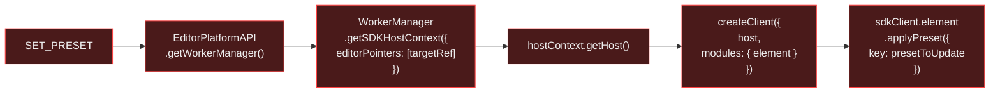

# Site Optimizer SET_PRESET Action — Isomorphic Analysis

Entry point: `presetsSiteOptimizerActionEntryPoint` in `responsive-editor-packages` (REP).

**File:** `packages/responsive-presets/src/entryPoints/presetsSiteOptimizerActionEntryPoint.ts`

---

## Verdict

**RED** — entirely dependent on `EditorPlatformAPI.getWorkerManager()` which requires
browser Web Workers. The actual preset application logic runs inside the SDK host context
(via a worker), making this inherently client-only as-is.

---

## Flow Diagram



---

## Breaking Point Map

| Step | API / Method | Verdict | Reason |
|---|---|---|---|
| 1 | `EditorPlatformAPI.getWorkerManager()` | ✗ RED | Browser Web Workers |
| 2 | `WorkerManager.getSDKHostContext({ editorPointers })` | ✗ RED | Client-side SDK host context |
| 3 | `hostContext.getHost()` | ✗ RED | Host is browser-based |
| 4 | `createClient({ host, modules: { element } })` | ✗ RED | SDK client built on browser host |
| 5 | `sdkClient.element.applyPreset({ key })` | ✗ RED | Executed inside worker context |

The entire chain after `getWorkerManager()` is client-side infrastructure.

---

## Solution

### Server-side SDK host context

**Problem:** The SDK host context (`WorkerManager → SDKHostContext → host → createClient`)
is browser-only infrastructure. The `@wix/sdk` `createClient()` and the `element` module
need a host context to execute, and that host is currently provided via a browser Web Worker.

**Solution:** Provide a server-side SDK host implementation:
```
ServerSDKHostContext
  → createClient({ host: serverHost, modules: { element } })
      → sdkClient.element.applyPreset({ key })
```

A server host would:
- Accept `editorPointers` (component refs) directly without iframe/worker communication
- Execute element operations against `DocumentServicesAPI` directly
- Not require `WorkerManager` at all

**This is the same architectural gap as SET_DATA** — both need the same server SDK host.
Building it once unblocks both actions (and likely future SDK-based actions too).

**Effort:** High — requires new server SDK host infrastructure.
The actual preset application logic inside the SDK may also have client-only deps
(preset data could involve layout measurements or stage context).

---

## Key Takeaways

1. **SET_PRESET is architecturally identical to SET_DATA** — both use `EditorPlatformAPI → WorkerManager → SDKHostContext → createClient → element.*`.
2. The SDK worker pattern is the **common blocker** for all SDK-based site-optimizer actions.
   A single server-side SDK host implementation would unblock both.
3. **The preset key itself is a pure data parameter** — there's nothing intrinsically
   client-only about "apply preset X to component Y". The blocker is the execution infrastructure,
   not the concept.
